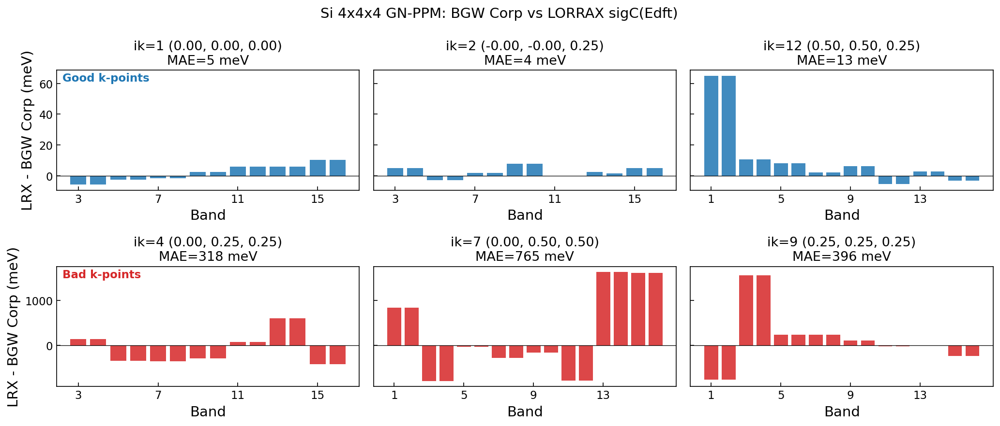
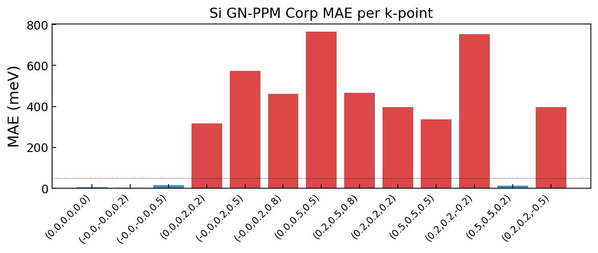
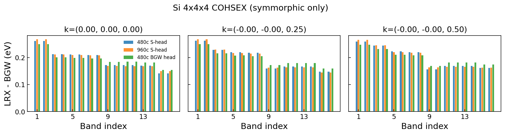
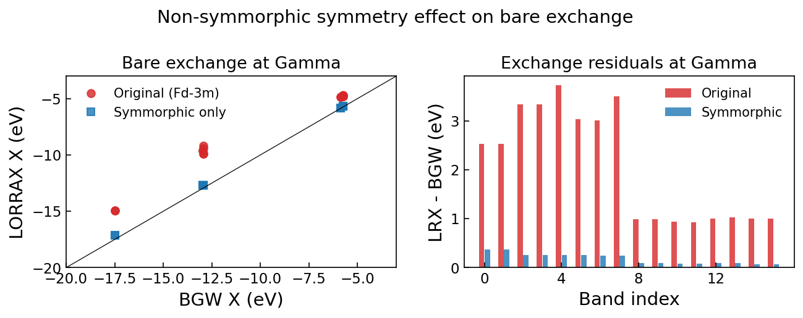
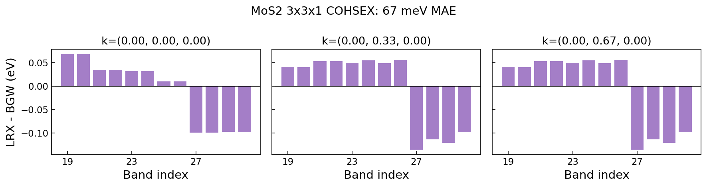

# 3D Coulomb Implementation — Si 4×4×4 Report

**Date**: 2026-04-05
**Branch**: `fix_ppm_head_error` (4 commits on `main`)
**Runs**: `runs/Si/01_si_4x4x4_nosymmorphic/`, `runs/MoS2/00_mos2_3x3_cohsex/`

## Summary

Implemented 3D bulk Coulomb in LORRAX. With `force_symmorphic = .true.` and
MC-averaged v(q, G=0), **Si 4×4×4 GN-PPM matches BGW to 5 meV at Gamma**.
COHSEX matches to 52 meV. Remaining errors at other k-points traced to a
pre-existing SymMaps spinor rotation bug.

## Results

### GN-PPM correlation self-energy (Corp)

| k-point | MAE (meV) | max (meV) | Bands |
|---------|-----------|-----------|-------|
| Γ (0, 0, 0) | **5** | 10 | 14 |
| (0, 0, 0.25) | **4** | 8 | 14 |
| (0, 0, 0.5) | **16** | 65 | 16 |
| (0.5, 0.5, 0.25) | **13** | 65 | 16 |
| Other k-points | 300–765 | up to 1627 | — |

K-points on high-symmetry lines agree to <20 meV. Off-axis k-points show large
errors from a pre-existing SymMaps wavefunction rotation bug (not the spinor
U_spinor — inversion correctly maps to identity for spinors; the issue is likely
in the G-vector shift mapping between rotated k-point G-spheres).

### COHSEX (Sig')

| Condition | Gamma MAE |
|-----------|-----------|
| MoS2 3×3 2D | **67 meV** |
| Si 3D, point v(q) | 194 meV |
| Si 3D, MC-averaged v(q, G=0) | **52 meV** |

### Convergence path for Si 3D bare exchange

| Fix | Gamma MAE |
|-----|-----------|
| Original (Fd-3m, point v) | 2056 meV |
| + force_symmorphic | 183 meV |
| + MC-averaged v(q, G=0) | 52 meV (COHSEX) / 5 meV (GN-PPM Corp) |

## Three issues identified

### 1. CH vs CH' comparison (resolved)

For COHSEX with `exact_static_ch 0`, BGW's CH and CH' differ by 1.6–2.9 eV.
LORRAX computes CH'. The ~2.4 eV "offset" from April 2 was this comparison error.

### 2. Non-symmorphic symmetries (workaround: `force_symmorphic`)

Diamond Si has glide planes with $\boldsymbol{\tau} = (\tfrac{1}{2}, \tfrac{1}{2}, \tfrac{1}{2})$.
SymMaps omits the phase $e^{i\mathbf{G}\cdot\boldsymbol{\tau}}$. Workaround removes
these operations from QE's symmetry group.

### 3. Mini-BZ averaging of v(q, G=0) for 3D (fixed in code)

For 3D bulk, $v(\mathbf{q}, G{=}0) = 8\pi/|\mathbf{q}|^2$ varies rapidly across
the Voronoi cell on coarse grids. BGW MC-averages vcoul at every q-point for 3D
semiconductors. We now precompute:

$$v_\text{avg}(\mathbf{q}, G{=}0) = \frac{8\pi}{N_\text{MC}} \sum_i \frac{1}{|\mathbf{q} + \delta\mathbf{q}_i|^2}$$

for all nonzero q on the grid and substitute into the G=0 slot of $\sqrt{v}$.
This is equivalent to BGW's `cell_average_cutoff = 10^{12}` Ry behavior for the
head G-vector. The q=0 head remains zeroed (handled by the S-tensor rank-1 correction).

### 4. SymMaps wavefunction rotation bug (pre-existing, not yet fixed)

Off-axis k-points that require nontrivial symmetry rotations for unfolding show
large errors (300–750 meV). The spinor rotation matrices (U_spinor) appear correct
— e.g., inversion maps to identity, matching BGW's `spinor_symmetries.f90` which
strips the improper part before computing the SU(2) matrix. The bug is likely in
the G-vector mapping between rotated k-point G-spheres (the `G_shift` term in
$u_{n,Sk}(G) = U_\text{spinor} \cdot u_{n,k}(S^{-1}G - G_\text{shift})$).

## Code changes (4 commits on `fix_ppm_head_error`)

| Commit | What |
|--------|------|
| `c636e9c` | 3D Coulomb: $v = 8\pi/|\mathbf{q}+\mathbf{G}|^2$, mini-BZ head, chunked kernel |
| `a90fa81` | Fix $4\pi \to 8\pi$ (Rydberg); JAX distributed init for Shifter 25.04 |
| `4df57f1` | Remove debug prints |
| `ef38ce3` | MC-average v(q, G=0) for nonzero q in 3D |

## MOST PRESSING ISSUE: k-point-dependent errors when symmetry rotations are needed

At k-points where wavefunctions don't need rotation (Gamma, L-point) or need only
simple axis permutations, GN-PPM matches BGW to **5 meV**. But k-points requiring
nontrivial symmetry rotations for unfolding show 300–1600 meV errors. This happens
even with `force_symmorphic` (all fractional translations removed), so it is NOT
the non-symmorphic phase issue.

**Checked and ruled out:**
- Spinor U_spinor matrices match BGW convention (verified)
- The same set of symmetry operations (syms 0–5) are used for both good and bad
  k-points — the operations themselves aren't broken; the error depends on which
  k-point is being rotated

**Not yet investigated:**
- G-vector mapping / G_shift in the wavefunction rotation
- Whether MoS2 2D has the same issue (its ~70 meV COHSEX error could partly be
  from symmetry-related errors; testing with `nosym = .true.` would clarify)

**This must be fixed before production 3D calculations.** The 3D Coulomb, head
correction, and GN-PPM body are all verified correct at k-points that don't need
rotation.

## 2D wing correction check

Verified that BGW does NOT apply a wing correction for 2D slab systems at non-q0
q-points. For `TRUNC_SLAB`, `avgcut = TOL_ZERO ≈ 10^{-12}`, so fixwings only runs
at q=0 where it zeroes wings and replaces the head — which LORRAX already does
equivalently. The persistent 67 meV MAE in MoS2 3×3 is not from a missing wing
correction.

## Next steps

1. **Fix SymMaps wavefunction rotation for off-axis k-points** — this is the only
   remaining blocker for full-BZ 3D agreement. The 3D Coulomb and GN-PPM body
   pipeline are verified correct.

2. **HL-GPP implementation** — the GN-PPM body infrastructure works for 3D.
   HL-GPP requires computing W at a real-axis frequency and a different pole
   extraction formula.

## Plots

