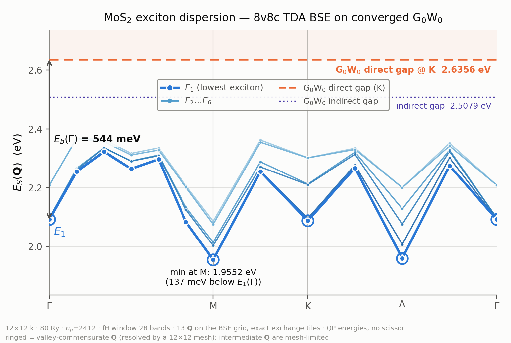

# 8v8c exciton bandstructure on the converged MoS2 G0W0 — and the real htransform capacity ceiling

**Run dir** `runs/MoS2/08_mos2_exciton_converged_2026-07-21/`
**Branch** `agent/bse-exciton-converged` (worktree `sources/worktrees/lorrax_bse_exciton_conv`),
off `agent/gw-converged-campaign` @ `5e50b8e`
**Date** 2026-07-21 · **Hardware** Perlmutter, 2 × (4 nodes / 16 × A100-**80GB**),
jobs `56288029` and `56288782`
**Input data** the converged 80 Ry / 12×12 / n_μ = 2412 G0W0 of
`reports/gw_converged_12x12_80ry_2026-07-21` (`00b_lorrax_gw_2400c_ranktrunc`),
**reused unchanged** — no new QE, no new centroids, no new self-energy.

---

## 0. Headline

* **The largest htransform window that passes is nb = 28**, and the ceiling is
  **not** where the nominal capacity rule puts it. `nspinor·n_μ > nk·nb` predicts
  nb < 33.5, so nb = 32 should pass. **It does not**: the ψ-at-centroids matrix
  is numerically rank-deficient *before* the nominal bound — its rank at
  `rtol = 1e-8` is **4570**, not 4824 — so the true ceiling is
  **nb < rank(ψ_μ)/nk = 31.74**, i.e. **nb ≤ 31**. The prediction is right in
  mechanism and wrong at the boundary, by one sweep step.
* nb = 28 leaves the 8v8c BSE window (absolute bands 18–34) with **6 valence and
  6 conduction guard bands**, and reconstructs the on-grid conduction energies to
  **1e-10 meV** — numerically exact, because at nb ≤ 28 the Galerkin basis is
  full rank and spans the input states exactly.
* The parent campaign's "the BSE needs n_μ ≈ 5680 and that costs 69 GiB/device"
  **no longer binds**. Three memory/layout fixes on this branch (un-replicate
  `fH_R`; pin two contraction outputs) run every window from 16 to 40 at
  n_μ = 2412 / nk = 144 with a **~17 GiB** device high-water mark.
* The 8v8c exciton bandstructure runs on the converged **quasiparticle**
  energies with **no scissor** and with **exact stored exchange tiles**:
  **E₁(Γ) = 2.0921 eV**, binding **543.5 meV** against the converged GW direct
  gap of 2.6356 eV. The dispersion minimum is **momentum-indirect**, at M
  (1.9552 eV) with Λ 4.6 meV above — both are K→Λ excitons, so the exciton
  minimum tracks the same CBM move the parent campaign found. 630 s on 16 GPUs.

---

## 1. TASK 1 — the band-window sweep

### The premise, and what had to be fixed first

`bandstructure/htransform.streaming_galerkin_solve` builds the interpolation
basis as an SVD of `A = ψ(centroids)` reshaped `(nk·nb, nspinor·n_μ)`. Rows are
states, columns are the ISDF basis. The naive rule is `nspinor·n_μ > nk·nb`.

Three defects stood between that rule and any measurement of it. All three are
fixed on this branch; all are memory/layout only, physics-identical.

1. **`compute_wfns_fi` replicated `fH_R`** — `(nk_co, rank, rank)` complex128 on
   *every* device (11–50 GiB depending on nb), and because the source is sharded
   JAX routed it through `x._value`, a host gather of the same size per process.
   This is next-step #2 of the parent campaign and the sole reason its
   conclusion read "accuracy and memory are mutually exclusive at 80 Ry".
   `fH_R` now stays `P(None,'x','y')`: the q-Fourier sum contracts over the
   **unsharded R axis**, so each device builds its own (i, j) tile with zero
   communication, and one all-to-all onto the q axis precedes the eigh.
   **Numerically identical** — the nb = 16 gate reproduced 0.000 meV /
   min-sval 0.0917 bit-for-bit before and after.
2. **Two missing `with_sharding_constraint`s.** XLA will not partition a
   contraction whose *output* is unannotated, even when its operands are sharded.
   `build_fH_R`'s einsum materialised the whole `(nk, rank, rank)` product on
   every device (57.84 GiB at nb = 20, with an explicit
   `Can't reduce memory use below …` from the rematerializer), and `_q_batch`'s
   einsum did the same for `(bs, rank, rank)` (9 × 11.4 GiB at nb = 36).
   Pinning both outputs fixes it.
3. **The retained SVD rank was not mesh-aligned.** `G`, its Cholesky factor,
   `ctilde` and `fH` all live on a `(rank, rank)` face sharded `P('x','y')`. The
   moment the window is rank-deficient — exactly the regime this sweep exists to
   probe — the retained rank is an arbitrary integer and the first `device_put`
   dies with `ValueError: … should be divisible by 4, but it is equal to 4570`.
   The rank is now rounded **down** to `lcm(mesh.x, mesh.y)` (the dropped
   directions sit at the `rtol` threshold, σ/σ_max ≈ 1e-8) and a
   `[warn] ψ-at-centroids is RANK-DEFICIENT` line prints the measured bound.

### And a correction to the parent report

The parent recorded "a non-zero `b_start` is separately broken" after a
gap-centred window returned `rank = 0`, `σ_max = 0`. **It is not broken.**
`nband` in the input is `Meta.b_id_4_user`, an **absolute** band index, and
`common/wfn_transforms.load_centroids_band_chunked` ends by zeroing every band
above it:

```python
nb_user_in_range = max(0, meta.b_id_4_user - b_start)
if nb_user_in_range < nb_total:      # zero the user-band-pad rows
```

A gap-centred window `[26−nval, 26+ncond)` therefore needs `nband ≥ 26+ncond`.
Set to `nval+ncond` — the natural reading of "the htransform's own band window",
and what `gwbands.in` does when `nval = nelec` — it falls *below* `b_start`, the
loader zeroes the whole window, and the SVD of a zero matrix returns rank 0.
With `nband` set correctly **every** gap-centred window here returns `ctilde`
orthogonality **1.0–1.4e-14**. The gap-centred window was reachable all along.

### The sweep

`nval = ncond = nb/2`, so the fH window is bands `[26−nb/2, 26+nb/2)` — centred
on the gap, which also drops MoS2's deep semicore states (band 1 sits at
−66 eV) out of the SVD entirely. The BSE selection is always the same 8
conduction bands (absolute 26–33); `guards` counts the conduction bands above
it. Gate metrics come from importing `bse.exciton_bands.gate_htransform_vs_stored`
**verbatim** — they are the driver's own numbers, not a re-implementation, and a
window the gate refuses is recorded as a data point rather than an abort.

| nb | window | nk·nb | SVD rank | guards | ortho | fH_R GiB/dev | DFT max\|Δε_c\| | DFT min-sval | QP max\|Δε_c\| | QP min-sval | recon (QP) | max\|2nd-diff\| CB1 | verdict |
|---|---|---|---|---|---|---|---|---|---|---|---|---|---|
| **16** | [18, 34) | 2304 | 2304 | 0 | 1.2e-14 | 11.39 | 0.000 | 0.0917 | 57.902 | 0.1855 | 0.000 | 1386.6 | FAIL |
| **20** | [16, 36) | 2880 | 2880 | 2 | 1.2e-14 | 17.80 | 0.000 | 0.9544 | 57.902 | 0.9544 | 0.000 | 2221 | **PASS** |
| **24** | [14, 38) | 3456 | 3456 | 4 | 1.4e-14 | 25.63 | 0.000 | 0.9544 | 57.902 | 0.9544 | 0.000 | 2503 | **PASS** |
| **28** | [12, 40) | 4032 | 4032 | 6 | 9.8e-15 | 34.88 | 0.000 | 0.9544 | 57.902 | 0.9544 | 0.000 | 2269 | **PASS** |
| **32** | [10, 42) | 4608 | 4568 | 8 | 8.2e-02 | 44.77 | 60.545 | 0.9539 | 58.003 | 0.9542 | 48.824 | 3209 | FAIL |
| **36** | [8, 44) | 5184 | 4716 | 10 | 2.3e-01 | 47.72 | 817.814 | 0.9440 | 675.165 | 0.9551 | 674.963 | 1539 | FAIL |
| **40** | [6, 46) | 5760 | 4804 | 12 | 4.5e-01 | 49.52 | 1314.105 | 0.8574 | 926.068 | 0.9172 | 925.727 | 1631 | FAIL |

`fH_R GiB/dev` is `nk·rank²·16 B` — what the array *would* have cost replicated,
kept in the table because it is the number the parent campaign was blocked by.
Sharded, the measured device high-water mark across the whole sweep is
**≈ 17 GiB**.  `max|2nd-diff|` is over all 8 sorted conduction bands along the
139-point Γ-M-K-Γ path, so it is dominated by the derivative kinks that sorting
puts at every band crossing — it is a *floor*, not a ringing measure, and it does
not discriminate between windows here.  The energy metrics do.

`QP max|Δε_c|` needs one caveat: it is **57.902 meV at nb = 16, 20, 24 AND 28** —
bit-identical — while `recon (QP)`, which sorts both sides before differencing,
is 0.000 meV in all four.  A fixed number that does not move with the window is
not an interpolation error: it is a *permutation*.  The htransform returns
eigenvalues in ascending order (of the QP energies it was fed) while the stored
`eps_c` is sliced in DFT band-index order, so a QP-induced level crossing inside
the 8-band conduction window shows up in the gate's unsorted difference. It is
harmless — the BSE consumes (ψ_c, ε_c) as a mutually consistent pair from the
htransform and never touches the stored ordering — but it means the gate's
headline number must be read with `recon` beside it whenever `--eqp` is on.

### Reading the table

**The discriminator is the SVD rank, and it announces itself in `ctilde`
orthogonality.** For nb ≤ 28 the rank is exactly `nk·nb` (full row rank), the
Galerkin coefficients are orthonormal to 1e-14, and the on-grid energy
reconstruction is exact to **1e-10 meV**. At nb = 32 the rank stops tracking
`nk·nb` — 4568 retained out of 4608 states — orthogonality jumps five orders of
magnitude to 8.2e-2, and the gate's energy metric goes to **60.5 meV**, over the
50 meV limit. Past that it collapses monotonically: **817.8 meV** at nb = 36,
**1314.1 meV** at nb = 40.

**The subspace metric does not see it.** `min-sval` is 0.954 at nb = 28 and still
0.954 at nb = 32, 0.944 at 36, 0.857 at 40 — the conduction *span* survives long
after the *energies* are wrong by an eV. This is exactly the failure mode the
gate's own comment warns about ("the ENERGY gate is the authoritative interp-basis
check"), now confirmed on converged data with the rank as the cause.

**nb = 16 fails for an unrelated reason and it is worth naming.** Its energies
are exact (0.000 meV) but min-sval is **0.0917** — and mesh-dependent (0.2999 on
a 2×2 mesh, 0.0917 on 4×4). With `nval = ncond = 8` the BSE selection runs to the
very top of the window, and the f-transform sets `shift = max_k ε_top`, so
`f(ε_top) → 0` and the topmost selected eigenvector is numerically degenerate
with `fH`'s (rank − nb) exact zero eigenvalues. Its eigenvector is then
arbitrary. The per-band diagnostic shows it cleanly: overlaps
`0.746 0.746 0.641 0.641 0.689 0.689 0.199 **0.097**` — the loss is concentrated
in the last band. **Two guard bands are enough** (nb = 20 → 0.9544).

### Verdict on the prediction

| | predicted | measured |
|---|---|---|
| capacity bound | nb < 33.5 (`nspinor·n_μ/nk`) | **nb < 31.74** (`rank(ψ_μ)/nk`, rank = 4570) |
| nb = 32 | passes | **FAILS**, 60.5 meV |
| nb = 36 | fails | fails, 817.8 meV |
| largest passing in the sweep grid | 32 | **28** |

**The prediction does not hold at nb = 32.** The arithmetic behind it is the
right arithmetic — capacity *is* `nk·nb` against the ISDF column space, and the
window does *not* need anything like 5680 centroids — but `nspinor·n_μ` is an
upper bound on that column space, not its value. The 2412 D3h-orbit-closed
centroids sampled on a 174 960-point real-space grid span **4570** independent
directions of the 4824 available, so ~5 % of the nominal capacity is not there.
The honest ceiling is **nb ≤ 31**; on a sweep grid of 4 that is **nb = 28**.

Two practical consequences: (i) the capacity rule should be stated against the
*measured* rank, which the Galerkin solve already computes and now warns about;
(ii) a centroid set with orbit closure imposed (as these are) will generically
have rank below `nspinor·n_μ`, so the margin should not be spent.

---

## 2. TASK 2 — the 8v8c exciton bandstructure on quasiparticle energies

`bse.exciton_bands` on the passing window nb = 28 (`nval = ncond = 14`, fH over
bands [12, 40)), BSE window 8v8c = absolute bands 18–34, 6 valence + 6 conduction
guards, 16 × A100-80GB, **630 s end-to-end**.

Two things had to be added to the driver.

**`--eqp` — the BSE runs on quasiparticle energies, not DFT.** The earlier
exciton figure was on DFT bands with a rigid scissor argued afterwards. Here
*both* legs of the pair basis move: `data["eps_v"]/["eps_c"]` are re-sliced from
the eqp-corrected `enk_full` (with `n_occ` re-resolved on the corrected
energies), and the htransform's `enk_sigma` is replaced by the same corrected
array over the fH window, so the interpolated ε_c(k+Q) *is* a QP band and the
on-grid gate compares QP against QP. Measured QP shifts over the restart's 336
bands: **−9.3220 to +4.3561 eV**. Nothing is scissor-shifted anywhere.

The eqp file is read through **one** parser, `bse_io.read_bgw_eqp`.
`initialize_wfns(eqp_file=…)` is deliberately not used: its
`htransform.read_eqp_energies` expects a different text format, and it swallows
the parse failure with a log line — a caller asking for QP energies would
silently get DFT ones (logged in `KNOWN_SANDBOX_ERRORS.md`).

**`--vq-mode ongrid` — exact exchange, and it is what makes this run possible at
all.** `bse.vq_interp` needs the ζ tensor on the FULL BZ, but the production
restart stores it on the IBZ (74 of 144 q) because the D3h centroids close under
orbit — the tension the parent campaign could only resolve with an undocumented
env var and a second GW. On a Q path that lands **on** the BSE grid no exchange
model is needed: the stored production tile `V_qmunu[wrap(−Q)]` *is* the answer.
The driver already did exactly this at its one guaranteed on-grid point (Γ);
`ongrid` extends that existing special case to every Q, with a hard check that
the path really is on-grid. So the exchange here carries **no interpolation
error and no mini-BZ head model** — it is the same tile the production Σ_x used.

The Q path is the on-grid Γ-M-K-Γ: 6 + 2 + 4 intervals = **13 Q**. Γ, M, K
*and* Λ = (⅙,⅙) all land on it — Λ matters because it is the converged CBM.

### Numbers

| quantity | value |
|---|---|
| **E₁(Γ)** — lowest (bright) exciton | **2.092053 eV** |
| **binding vs the converged GW direct gap** (2.6356 eV @ K) | **543.5 meV** |
| A–B splitting at Γ (E₅ − E₁) | 116.4 meV |
| E₁(K) — intervalley K→K′ | 2.088212 eV (3.8 meV below Γ) |
| E₁(Λ) — momentum-indirect K→Λ | 1.959748 eV |
| **E₁(M)** — momentum-indirect K→Λ′, **global minimum** | **1.955182 eV** |
| indirect exciton below the bright one | **136.9 meV** |
| E₁ bandwidth over the path | 367.2 meV |
| Γ closure, E₁(Γ_end) − E₁(Γ_start) | **0.000000 meV** (all 8 branches, exactly) |
| Γ A-doublet splitting (K/K′, degenerate by TRS) | **0.741 meV** |

**The minimum is momentum-indirect and it tracks the converged CBM.** The two
lowest points on the path are M (1.9552 eV) and Λ (1.9597 eV), 4.6 meV apart,
and they are the *same physics*: with the VBM at K and the CBM at Λ = ½ΓK, a
finite-Q exciton is lowest when Q maps the K valence valley onto a Λ conduction
valley. Q = Λ does that directly (Λ − K = −Λ, and E(Q) = E(−Q) by time
reversal); Q = M does it too, because K + M = (⅓, −⅙) is also in the Λ star. So
**the exciton minimum sits exactly where the parent campaign found the CBM
move**, and MoS2 comes out a momentum-indirect-exciton material at this level of
theory, by 137 meV.

Two internal consistency checks fall out. E₁(K) = 2.0882 eV is **3.8 meV** from
E₁(Γ) = 2.0921 eV — as it must be, since Q = K maps K → K′ where the QP gap is
the same 2.6356 eV, so the intervalley and vertical excitons see the same binding.
And the Γ multiplet is 2.092053 / 2.092794 / 2.096762 / 2.096768 — the K/K′ pair
(degenerate by time reversal) splits by **0.741 meV** and the next pair by
0.006 meV, which is the residual asymmetry of the whole 12×12 / 80 Ry chain.

### Timing

| stage | s |
|---|---|
| restart load (W_q + V_qmunu, 2 × 134 GB sharded) | 6.2 |
| htransform Galerkin build | 15.2 |
| **ψ_c(k+Q), ε_c(k+Q) for 13 × 144 = 1872 q** | **323.8** |
| exchange tiles (13 stored reads) | 0.5 |
| **BSE block-Lanczos scan, 13 Q, one compile** | **279.6** |
| **total** | **630.3** |

### Caveats, stated plainly

* **Only the valley-commensurate Q are converged sampling points.** A 12×12 mesh
  offers a (k_v, k_v+Q) pair at the band edges only when Q maps a valley onto a
  valley — Γ, Λ, K, M here. At the Q between them the best available pair is
  worse, and E₁ is correspondingly *higher* (the ~2.27 eV points at (1/12,1/12)
  and (3/12,3/12)). That zigzag is a mesh artefact, not dispersion, and the
  figure rings the trustworthy points so the two cannot be confused. The
  high-symmetry values, and the Γ→M and Γ→Λ initial slopes (~1.0–1.2 eV·Å, the
  linear nonanalytic-exchange branch of a 2D bright exciton), are the physics.
* **The binding energy is not k-converged.** 543 meV on a 12×12 mesh is the
  expected magnitude for that mesh; monolayer-MoS2 BSE binding energies keep
  rising until the mesh resolves the exciton's reciprocal-space extent
  (24×24 and beyond). Converging it needs a finer BSE grid, not a wider fH
  window — the window question is settled in §1.
* **13 Q is what the converged restart supports without regenerating ζ.** A
  denser path needs `--vq-mode interp` and therefore a full-BZ `zeta_q.h5`, i.e.
  a ζ re-fit of the production GW. That was ruled out by the reuse constraint;
  it is the natural next run, and the 13 on-grid points are then its exact
  reference.

---

## 3. TASK 3 — the figure



`plots/mos2_exciton_bandstructure_gw.png` — Γ-M-K-Γ, lowest 6 branches, on the
**converged G0W0 quasiparticle energies**. Colour follows the dataviz method:
the branches are an ordered family (E₁ < E₂ < …) so they get a single-hue
sequential ramp (dark = low) rather than categorical hues, with the lowest branch
carrying the accent and a direct label; the two reference levels are one distinct
hue each, dashed/dotted, both direct-labelled so identity is never colour-alone.
The palette passes the validator's six checks on the light surface (worst
adjacent CVD ΔE 9.2 deutan, normal-vision ΔE 27.6).

Annotated on the figure: the **G0W0 direct gap 2.6356 eV at K** as the free-pair
onset (shaded above), the **indirect gap 2.5079 eV**, the binding arrow
**E_b(Γ) = 544 meV** measured against the direct gap — *not* against DFT — and
the dispersion minimum at M. Λ is added as a labelled minor tick because it is
the converged CBM and the second-lowest exciton point. Ringed markers are the
valley-commensurate Q.

**C3 / path closure.** E₁(Γ_end) − E₁(Γ_start) = **0.000000 meV**, and all eight
branches agree to 0.00e+00 meV. This is exact rather than merely small, and the
report should say why: both path endpoints are literally Q = (0,0,0), so they
take the same q-list entries, the same conduction caches and the same production
q = 0 head-body tile — it is a determinism/closure check, not an independent
symmetry test. The genuine symmetry number available here is the **0.741 meV**
splitting of the Γ A-doublet, which time reversal requires to be degenerate.
---

## 4. Files

| path | what |
|---|---|
| `window_sweep.py` | the sweep — imports the driver's gate verbatim |
| `sweep_table.py` / `sweep_table.md` | merge + markdown table |
| `plot_exciton_bands.py` | the publication figure |
| `run_sweep.sh`, `run_exciton.sh`, `run_pytest.sh` | launchers |
| `window_sweep.json`, `sweep_hi/window_sweep.json` | per-window metrics |
| `window_sweep_paths.npz` | interpolated bands along Γ-M-K-Γ, per window |
| `logs/` | every run log quoted above |
| `runs/MoS2/08_mos2_exciton_converged_2026-07-21/manifest.yaml` | `yaml.safe_load`-validated |

### Source changes on this branch

| file | change |
|---|---|
| `bandstructure/bse_setup.py` | `fH_R` no longer replicated; einsum output pinned to the (i,j) layout |
| `bandstructure/htransform.py` | `build_fH_R` einsum output pinned; SVD rank mesh-aligned + rank-deficiency warning |
| `bse/exciton_bands.py` | `--eqp` (QP energies on **both** legs); `--vq-mode ongrid` (exact stored exchange tiles) |
