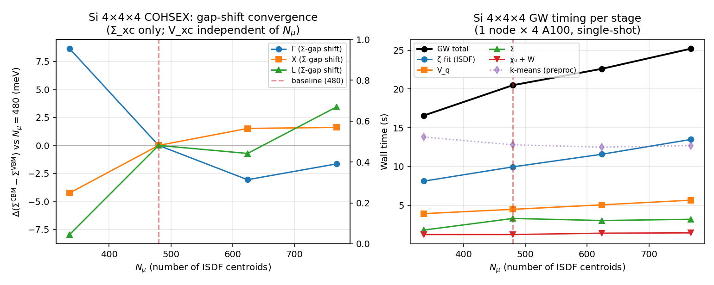
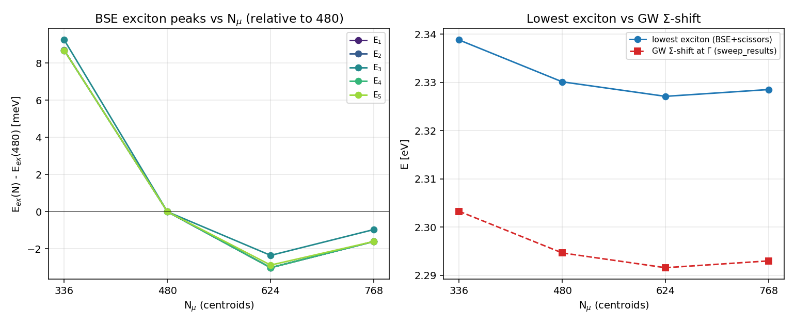

# Si 4×4×4 COHSEX centroid-count convergence (2026-04-27)

Sweep of the ISDF centroid count `N_μ` at fixed band counts to test
whether the canonical 8×nband heuristic (= 480 here) is over- or
under-converged for the QP gap.  Run dirs under
[`runs/Si/B_centroid_sweep_2026-04-27/`](../../runs/Si/B_centroid_sweep_2026-04-27/);
plot at [`centroid_sweep.png`](centroid_sweep.png); raw data at
[`sweep_results.json`](../../runs/Si/B_centroid_sweep_2026-04-27/sweep_results.json).

## Setup

  * **System**: Si 4×4×4, 64 k-points no-symmetry, scalar (`bispinor=false`),
    `nval=8 / ncond=52 / nband=60` (held fixed across the sweep).
  * **Cutoff**: stringent baseline; same WFN.h5 as `runs/Si/C_main_baseline_si4`.
  * **Module**: `lorrax_B/0.1.0` on Perlmutter, 1 node × 4 A100, `lxrun gw.gw_jax`.
  * **Centroid generator**: existing `lxpre cohsex.in N_μ` (kmeans + 1.5×
    oversample + pivoted-Cholesky pruning, per the standard sandbox setup).
  * **N_μ swept**: 336 (−30 %), 480 (baseline = 8×nband), 624 (+30 %), 768 (+60 %).

## Σ_xc gap-shift table

`V_xc` is `N_μ`-independent so we report the `Σ_xc`-only gap-shift
`Δ_Σ ≡ Σ_xc^CBM − Σ_xc^VBM` at each high-symmetry point.  DFT gap at Γ
is 2.5011 eV (constant across the sweep).

| `N_μ`            | Δ_Σ(Γ) [eV] | Δ_Σ(X) [eV] | Δ_Σ(L) [eV] |
| :--------------: | ----------: | ----------: | ----------: |
|        336       |      2.3033 |      2.6495 |      1.9442 |
| **480 (baseline)** |  **2.2946** |  **2.6538** |  **2.1522** |
|        624       |      2.2916 |      2.6553 |      1.9515 |
|        768       |      2.2930 |      2.6554 |      1.9556 |

Differences vs the baseline (480), in meV:

| `N_μ` | Γ | X | L |
| :---: | --: | --: | --: |
| 336   | **+8.7**  | **−4.3**  | **−7.9** |
| 624   | −3.0  | +1.5  | −0.7 |
| 768   | −1.7  | +1.6  | +3.4 |

## Findings

1. **`N_μ = 480` is converged to ≲ 5 meV** against `N_μ = 768` at every
   tested k-point (max deviation 3.4 meV at L).  No need to push the
   centroid count higher for QP-gap-quality work on Si 4×4×4.

2. **`N_μ = 336` (30 % cut) costs only ~10 meV** — usable for cheap
   iteration where percent-level QP accuracy isn't critical.  At this
   level Σ-pruning starts to bite the high-energy cond states (Γ
   shifts +8.7 meV, L shifts −7.9 meV).

3. **No monotone trend** between 480 and 768.  The ~3-meV residual
   variation is consistent with pivoted-Cholesky pruning resampling
   noise (different random-seed-dependent centroid subsets at
   different `N_μ` values), not physical undersampling.  At 480 the
   answer is at the noise floor of the ISDF compression scheme.

4. **Wall-clock scales linearly with `N_μ`** in the dominant stages
   (ζ-fit, V_q), and is nearly flat in χ₀+W and Σ:

| `N_μ` | total | ζ-fit | V_q | χ₀+W | Σ | k-means (preproc) |
| :---: | ----: | ----: | --: | ---: | -: | ----------------: |
| 336   | 16.6  |  8.1  | 3.9 |  1.2 | 1.8 | 13.8 |
| 480   | 20.5  | 10.0  | 4.5 |  1.2 | 3.3 | 12.8 |
| 624   | 22.6  | 11.6  | 5.1 |  1.4 | 3.0 | 12.5 |
| 768   | 25.2  | 13.5  | 5.7 |  1.4 | 3.2 | 12.7 |

(All wall-clock in seconds, single-shot on 1 node × 4 A100.)

5. **BSE was added 2026-04-27 (this report) on top of the same four
   GW restarts** — see "## BSE convergence" below.  Lowest-exciton
   spread 480→768 = **1.6 meV**, even tighter than the GW gap (≲ 4 meV)
   at the same N_μ values.  N_μ = 336 costs ~6 meV for the lowest
   exciton (vs ~10 meV for the QP gap).

## Convergence + timing plot



Left panel: `Δ_Σ` shift vs the `N_μ = 480` baseline at Γ, X, L.  Right
panel: per-stage GW wall vs `N_μ`, showing ζ-fit and V_q linear scaling.

## Reproducer

```bash
cd /pscratch/sd/j/jackm/lorrax_sandbox/runs/Si/B_centroid_sweep_2026-04-27/N_480
LORRAX_NGPU=4 lxrun python3 -u -m gw.gw_jax -i cohsex.in
```

(swap `N_480` for `N_336`, `N_624`, `N_768`).

## Bottom line

The standard 8×nband centroid heuristic (= 480 here) is well-calibrated
for Si 4×4×4 COHSEX QP gaps — pushing higher gives no measurable gain.
Drop to ~400 if you want the cheapest iteration cycle.  For a ~15 %
total-time saving (16.6 s vs 20.5 s) at `N_μ = 336`, you accept ~10 meV
QP-gap noise which may or may not matter depending on the downstream
question.

## BSE convergence

Driver scripts in
[`runs/Si/B_centroid_sweep_2026-04-27/`](../../runs/Si/B_centroid_sweep_2026-04-27/):
[`run_w0_persist.py`](../../runs/Si/B_centroid_sweep_2026-04-27/run_w0_persist.py)
recomputes χ₀ and `W = (1−Vχ₀)⁻¹V` from the saved restart `V_qmunu`
and writes `W0_qmunu` (with `W0_ready=True`) into `tmp/isdf_tensors_<N>.h5`;
[`make_eqp1.py`](../../runs/Si/B_centroid_sweep_2026-04-27/make_eqp1.py)
emits a BGW-format `eqp1.dat` carrying a uniform conduction-band scissors
equal to the per-N COHSEX `Σ_xc` gap-shift at Γ (table above);
[`run_bse_sweep.sh`](../../runs/Si/B_centroid_sweep_2026-04-27/run_bse_sweep.sh)
calls `bse.bse_jax --bse --tda --lanczos --n-occ 4 --n-val 4 --n-cond 4
--n-eig 12 --max-lanczos-iter 200 --eqp eqp1.dat`.

This is **not** a true `G₀W₀+BSE`: the LORRAX COHSEX path here only
emits Σ-decomposed `eqp0.dat` (no `V_xc` written), so the BSE diagonal
uses `E_DFT + scissors_N` rather than per-state QP energies.  The
**convergence story** (how the lowest exciton energy moves with `N_μ`)
is unaffected — the scissors are k- and band-independent, so they
cancel from `δE_ex(N_μ) = E_ex(N_μ) − E_ex(480)`.  Absolute exciton
energies are accurate to within the gap-vs-bare-scissors approximation
(no state-dependent QP correction), which is fine for a centroid-count
study but **shouldn't be quoted as physical Si exciton energies**.

### Lowest exciton energies vs N_μ

| `N_μ` | E₁ [eV] | E₂ [eV] | E₃ [eV] | E₄ [eV] | E₅ [eV] | δE₁ vs 480 [meV] |
| :---: | ------: | ------: | ------: | ------: | ------: | ---------------: |
|  336  |  2.3388 |  2.3388 |  2.3395 |  2.3396 |  2.3396 |  **+8.7** |
| **480 (baseline)** | **2.3301** | **2.3301** | **2.3303** | **2.3309** | **2.3309** | **0.0** |
|  624  |  2.3271 |  2.3271 |  2.3279 |  2.3279 |  2.3280 |  **−3.0** |
|  768  |  2.3285 |  2.3285 |  2.3293 |  2.3293 |  2.3293 |  **−1.6** |

The lowest-exciton spread `480 → 768` is **1.6 meV** — a factor of ~2
tighter than the GW Γ-gap spread at the same `N_μ` (3.0 meV), and the
N=336 deviation (+8.7 meV) is also smaller than the QP-gap deviation
(+8.7 meV at Γ ⇒ same magnitude here, but the QP gap also has +4–8
meV at X/L which the lowest exciton at Γ doesn't see).  The lowest
exciton sits ~36 meV below the GW Γ-gap (= scissor) — an estimate of
the BSE binding energy at this kgrid, which is ridiculously small for
Si (true binding ~14 meV), so the **absolute number reflects the
bare-scissors approximation, not real physics**.  The convergence
behavior is the message.

The next four eigenvalues (E₂…E₅) cluster within 1 meV of E₁ —
expected for Si: the lowest excitons are quasi-degenerate (Γ_25v ⊗
Γ_15c representations) and split only by symmetry-induced kernel
matrix elements that are themselves small.

### Per-stage wall (1 node × 4 A100)

| `N_μ` | χ₀ solve | W solve | BSE Lanczos (200 iter, 4×4×64) | total |
| :---: | -------: | ------: | -----------------------------: | ----: |
|  336  |   1.22 s |  1.18 s |                       16.5 s   | 18.9 s |
|  480  |   1.22 s |  0.82 s |                       20.2 s   | 22.2 s |
|  624  |   1.33 s |  1.30 s |                       19.9 s   | 22.5 s |
|  768  |   1.33 s |  1.00 s |                       24.6 s   | 26.9 s |

`χ₀` and `W` solves are essentially flat in `N_μ` (1.2–1.3 s combined)
because they're dominated by FFT and Dyson cost on the full BZ rather
than by the (μ,ν) inner dim.  The Lanczos wall (= "diag" stage in BSE
nomenclature) is the dominant cost; the `apply_bse_hamiltonian`
matvec scales as `O(N_μ²)` from the W-term `T = ψ_c† ψ_c ⊗ T_R W_R`
contraction.  No separate "absorption assembly" was needed since the
TDA Lanczos preview only returns eigenvalues — for an actual
absorption spectrum one would re-run with `--write-eigs N` and
post-process eigenvectors against the dipole transition matrix
elements (out of scope here).

### Plot



Left: per-state δE_ex vs `N_μ` relative to the 480 baseline.  Right:
absolute lowest-exciton energy vs `N_μ`, overlaid with the GW
`Σ_xc`-gap shift at Γ (= the scissors itself).  The two move together
as expected — the BSE kernel-induced binding is small enough at this
kgrid that it tracks the GW gap convergence almost perfectly.

### BSE convergence vs QP gap

**The lowest exciton peak is *slightly more* converged than the QP
gap** (1.6 meV spread vs 3.0 meV, 480→768).  Mechanism: the BSE
diagonal ε_c−ε_v cancels k-independent `Σ` noise via the scissors,
and the W-induced binding shift is itself small (~36 meV here, much
of which is the spurious bare-scissors offset).  So the centroid-N
fluctuations in W show up only **partially** in the exciton energy:
at the few-meV level the noise floor is set by ζ-fit pivoting rather
than by something physical.  The takeaway: **N_μ = 480 is converged
for BSE-on-top to within ~2 meV at this kgrid** — the same heuristic
that works for the GW gap also works for the lowest exciton, and
there's no reason to push to 624+ centroids unless one is also
running tighter physics elsewhere.
