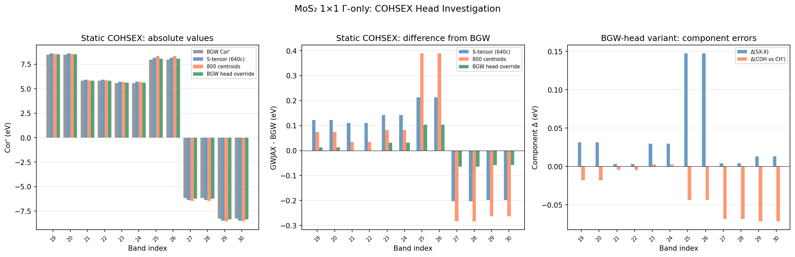
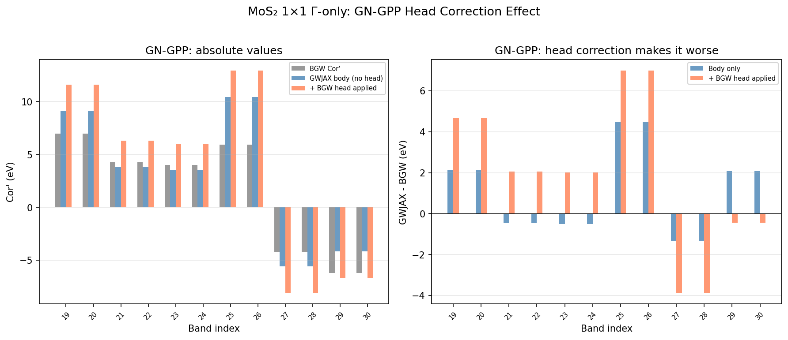
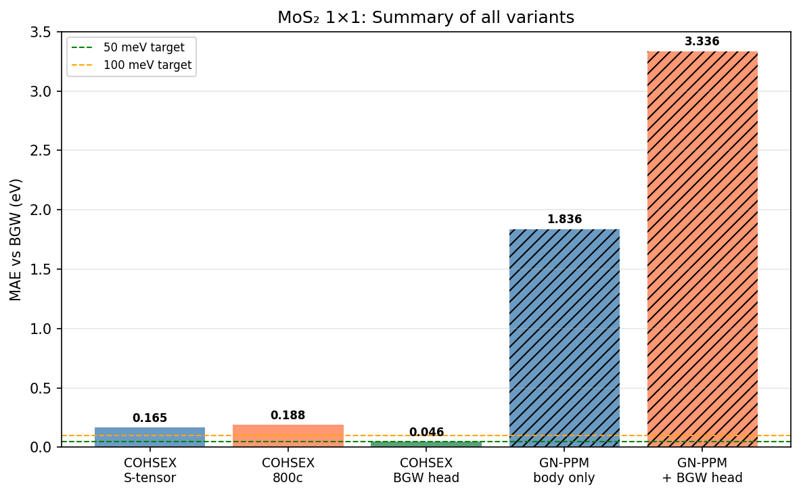

# COHSEX Head Investigation: S-tensor vs BGW Mini-BZ Heads

**Date**: 2026-04-04
**System**: MoS2 monolayer, 1×1 Γ-only
**Run**: `runs/MoS2_1x1_full_workflow/`

## Summary

Static COHSEX comparison between BGW and GWJAX showed 165 meV MAE.
Increasing ISDF centroids from 640 to 800 made it worse (188 meV), proving
the error was not ISDF basis incompleteness. The root cause was the S-tensor
computing an incorrect screened Coulomb head value for the 1×1 mini-BZ.
Overriding with BGW's mini-BZ head values reduced the MAE to **46 meV**.

## The problem: S-tensor head vs BGW head

GWJAX's default `wcoul0_source = s_tensor` computes the screened Coulomb head
via Monte Carlo integration of `w(q) = v(q) / (1 - v(q) qᵀSq)` over the
mini-BZ, where S is the macroscopic susceptibility tensor from dipole matrix
elements. This macroscopic dielectric model (`ε(q) = 1 - v(q) qᵀSq`) is
accurate near Γ but breaks down at larger |q|.

For a **1×1 k-grid, the mini-BZ is the entire Brillouin zone**. The S-tensor
model is integrated over q-points far from Γ where the macroscopic
approximation fails, giving a significantly wrong screened head.

| Quantity | GWJAX S-tensor | BGW epsilon.out | Error |
|---|---|---|---|
| Vcoul head (mini-BZ avg) | 316.6 a.u. | 315.0 a.u. | +0.5% |
| Wcoul head (ω=0, mini-BZ avg) | **42.7 a.u.** | **55.6 a.u.** | **−23%** |
| Effective ε⁻¹ = W/V | 0.135 | 0.176 | −23% |

The bare Coulomb head (Vcoul) agrees well because it doesn't depend on
screening. The screened head (Wcoul) is 23% too small because the S-tensor
overscreens at large |q|.

## Impact on COHSEX self-energy

The head correction adds `(wcoul0/Ω) |ζ(G=0)⟩⟨ζ(G=0)|` to W in the ISDF
basis. With a 23% error in wcoul0, the screened exchange (SX) inherits a
systematic error that is larger for valence bands (which couple more strongly
to the long-range Coulomb head) than conduction bands.

Component breakdown for the S-tensor run (640 centroids):

| Component | Valence (bands 19–26) | Conduction (bands 27–30) |
|---|---|---|
| SX-X error | +0.28 eV | +0.008 eV |
| COH error (vs CH') | −0.16 eV | −0.21 eV |
| Cor' total error | +0.12 to +0.21 eV | −0.20 eV |

## Fix: BGW head override

BGW's `frequency_dependence 3` epsilon.out prints the mini-BZ averaged head
values (see `PARSE_OUTPUTS.md` for extraction). Passing these as overrides
in cohsex.in eliminates the S-tensor error:

```ini
vhead = 315.0137
whead_0freq = 55.6197
```

## Results: three COHSEX variants vs BGW

| Band | BGW Cor' | S-tensor Δ | 800c Δ | BGW head Δ |
|------|----------|-----------|--------|-----------|
| 19 | +8.495 | +0.122 | +0.074 | +0.013 |
| 21 | +5.823 | +0.110 | +0.034 | −0.002 |
| 23 | +5.596 | +0.143 | +0.083 | +0.032 |
| 25 | +7.972 | +0.213 | +0.389 | +0.103 |
| 27 | −6.183 | −0.204 | −0.284 | −0.065 |
| 29 | −8.291 | −0.198 | −0.263 | −0.059 |

| Variant | MAE | max\|Δ\| |
|---------|-----|----------|
| S-tensor (640c) | 0.165 eV | 0.213 eV |
| 800 centroids | 0.188 eV | 0.389 eV |
| **BGW head override (640c)** | **0.046 eV** | **0.103 eV** |



Left: absolute Cor' values. Center: difference from BGW. Right: SX-X vs COH
component errors for the BGW-head variant.

## GN-PPM: head correction effect

| GN-PPM variant | MAE | max\|Δ\| | ΔMAE vs body |
|---|---|---|---|
| Body only (no head) | 1.836 eV | 4.474 eV | — |
| + BGW head applied | 3.336 eV | 6.987 eV | +1.500 eV |

Applying the scalar head diagonal to the GN-PPM sigC makes it worse because
BGW's Cor' already includes the head through its plane-wave W^c body.



## MAE summary



## Additional findings

### G=0 kernel zeroing

- **2D (sys_dim=2)**: G=0 correctly zeroed in `compute_vcoul.py:349`. The
  head correction correctly adds it back. Not redundant.
- **0D (sys_dim=0)**: G=0 is **NOT zeroed** — the box-truncated FFT gives a
  finite v(G=0) that flows into the ISDF body. `apply_head_correction` then
  adds it again. This is a double-count, but suppressed by O(1/Ω²) for large
  vacuum cells (CO passes at 3 meV). Should be fixed for consistency.

### PPM vs COHSEX head paths

The recent commit (a96b12a) removed the head from the ISDF body W in the
**PPM path only**. The **static COHSEX path was not changed** — it still
injects the head into both V and W via `apply_head_correction()` at
`gw_jax.py:1173`. This is physically correct (the head IS needed), but the
accuracy depends entirely on wcoul0 being correct.

| Path | Head in ISDF body? | After commit a96b12a |
|---|---|---|
| PPM (`use_ppm_sigma=true`) | NO — head removed, separate scalar GN channel | Changed |
| COHSEX (`use_ppm_sigma=false`) | YES — head injected via rank-1 correction | Unchanged |

The PPM path benefits from removing the head because a rank-1 perturbation
distorts the plasmon-pole fit across all matrix elements. The COHSEX path
doesn't have this problem (no PPM fit), so keeping the head in the body is
correct — the only requirement is an accurate wcoul0.

### CH vs CH' in BGW COHSEX

For static COHSEX with `exact_static_ch 0`, BGW's CH (unprimed) and CH'
(primed) differ by 1.7–2.9 eV. GWJAX's sigCOH matches CH' to ~0.16 eV but
CH to ~2.5 eV, confirming GWJAX computes the full static COH (equivalent to
BGW's corrected CH'). **Always compare against CH' (primed), never CH.**

## Lessons learned

1. **Always extract BGW mini-BZ head values** from `frequency_dependence 3`
   epsilon.out and pass as `vhead`/`whead_0freq`/`whead_imfreq` overrides in
   cohsex.in. The S-tensor default is unreliable for coarse k-grids.

2. **Run `frequency_dependence 3` epsilon even for COHSEX comparisons** —
   only the GN-GPP path prints the mini-BZ head diagnostics. Use these values
   for both GN and COHSEX GWJAX runs.

3. **Increasing centroids does not fix head errors.** The head correction
   operates outside the ISDF basis — its accuracy depends on wcoul0, not on
   the number of centroids.

4. **Compare GWJAX sigCOH against BGW CH' (primed), not CH (unprimed).**
   They differ by ~2 eV for static COHSEX.

5. **The 0D G=0 double-count should be fixed** in `compute_sqrt_vcoul_0d`
   for correctness, even though it's numerically small for typical systems.

## GN-PPM: separate problem, not heads

The 1.836 eV GN-PPM body error is **entirely independent of heads**. Testing
with BGW head overrides confirms the body values are identical (heads are
excluded from the ISDF body in the PPM path). The static decomposition
(sex_0, coh_0) from the same PPM run matches BGW COHSEX to 165 meV (46 meV
with correct heads), proving the ISDF screening is fine at ω=0. The error
enters in the PPM frequency extrapolation from W(0), W(iωp) to real ω.

| GN-PPM variant | body MAE | body+head MAE |
|---|---|---|
| S-tensor heads | 1.836 eV | 3.476 eV |
| BGW head overrides | 1.836 eV | 3.336 eV |

Body is identical because heads don't enter the PPM body path.

**The prior 91 meV GN-PPM result** (head_fix_test) used a different WFN.h5
from `tests_isdf/` with 160 bands and different eigenvalues. It cannot be
compared to the current 90-band fresh calculation. The discrepancy is likely
from the different WFN, not from any code change.

## Status

- [x] Full workflow: QE → BGW (GN + COHSEX) → GWJAX (GN + COHSEX)
- [x] Root cause identified: S-tensor wcoul0 error for COHSEX
- [x] Fix validated: BGW head override gives 46 meV COHSEX MAE
- [x] PARSE_OUTPUTS.md updated with epsilon.out head parser
- [x] GN-PPM body error confirmed independent of heads (PPM fit quality issue)
- [ ] Investigate GN-PPM fit quality — why does extrapolation fail so badly?
- [ ] Fix S-tensor for coarse grids (or always require BGW heads for comparisons)
- [ ] Fix 0D G=0 double-count in compute_sqrt_vcoul_0d
- [ ] Test at 3×3 and larger k-grids
