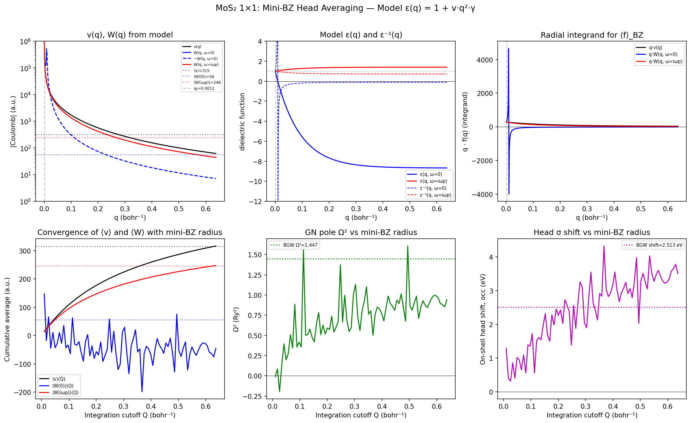

# Head Correction Investigation: BGW vs GWJAX for 2D GN-GPP and COHSEX

**Date**: 2026-04-04 – 2026-04-05
**System**: MoS₂ monolayer, 1×1 Γ-only
**Run**: `runs/MoS2_1x1_full_workflow/`

## Summary

Investigated why GWJAX's GN-PPM self-energy disagrees with BGW by ~1.8 eV
for 2D MoS₂. The root cause is that GWJAX applies a ±2.5 eV diagonal head
correction that has no counterpart in BGW. Debug prints added to BGW Sigma
confirm that the head (G=G'=0) element contributes **~0.5 meV** to BGW's
Cor' — essentially zero — because `vcoul(G=0)` at the shifted q-point is
tiny (0.45 a.u., not the mini-BZ average of 315 a.u.).

Separately, for static COHSEX, the head treatment is different (head enters
V and W symmetrically, COH = ½(W−V) largely cancels it), and GWJAX matches
BGW to **46 meV MAE** when using BGW's mini-BZ averaged head values.

## How BGW treats the head in GN-GPP

BGW does nothing special for the head. Every (G,G') element of ε⁻¹ is
treated identically in `mtxel_cor.f90`:

1. Read $\varepsilon^{-1}(G,G')$ at two frequencies from `eps0mat.h5`
2. Compute $I_\varepsilon = \delta_{GG'} - \varepsilon^{-1}(G,G')$
3. Fit one GN pole: $\tilde\omega^2 = \omega_p^2\, I_\varepsilon(i\omega_p) / (I_\varepsilon(0) - I_\varepsilon(i\omega_p))$
4. Evaluate SX and CH, accumulate with `vcoul(G')` as outer weight

For `freq_dep=3` with 2D slab truncation, `fixwings_dyn` does **not**
modify the head of ε⁻¹ (confirmed in code, lines 244–261: only wings are
modified). The head stored in `eps0mat.h5` enters the GN fit unmodified.

**Debug prints confirm** (added to `mtxel_cor.f90` and `sigma_main.f90`):

```
SIGMA HEAD post-fixwings: epsR(G=0,Gp=0,w1) = 8.949E-01
SIGMA HEAD post-fixwings: epsR(G=0,Gp=0,w2) = 9.946E-01
SIGMA HEAD post-fixwings: vcoul(1)           = 4.486E-01

GN HEAD: I_eps(w1,w2) = 1.051E-01  5.414E-03
GN HEAD: wtilde2      = 4.021E+01  invalid = F
GN HEAD: wtilde       = 6.341E+00
```

Key values:

| Quantity | Value | Note |
|---|---|---|
| $\varepsilon^{-1}(0,0;\omega\!=\!0)$ | 0.895 | < 1, normal screening |
| $I_\varepsilon(\omega\!=\!0)$ | +0.105 | positive, valid |
| $I_\varepsilon(\omega\!=\!i\omega_p)$ | +0.005 | positive, valid |
| $\tilde\omega^2$ | +40.2 Ry² | valid pole |
| $v_\text{coul}(G\!=\!0)$ | 0.449 a.u. | at shifted q-point, NOT mini-BZ avg |
| On-shell head $\Sigma^c$ | ~0.5 meV | negligible |

The earlier confusion: I mistook the printed "Head of Epsilon = 1.152" for
ε⁻¹ when it was ε. The actual ε⁻¹ head is 0.895. There is no anti-screening.

## What GWJAX does differently

GWJAX's `head_correction.py` fits a GN pole from mini-BZ averaged values:

| Quantity | GWJAX | BGW |
|---|---|---|
| Input to GN fit | $W^c = \langle W\rangle - \langle v\rangle$ | $I_\varepsilon = 1 - \varepsilon^{-1}(q_0)$ |
| Effective vcoul | $\langle v\rangle = 315$ a.u. | $v(q_0) = 0.45$ a.u. |
| On-shell shift | ±2.513 eV | ±0.0005 eV |
| **Ratio** | | **~5000×** |

The GN pole formalism is algebraically equivalent when using the same inputs
(verified: same poles, signs, on-shell magnitudes). The entire discrepancy
comes from **what vcoul the head contribution is weighted by**.

In BGW, the q→0 Coulomb divergence enters through the mini-BZ averaged
`vcoul` in the **bare exchange** $\Sigma_x$ (set up in `vcoul_generator`),
not through the correlation $\Sigma_c$. The correlation head element uses
the small $v(q_0)$ and contributes negligibly.

GWJAX's head correction tries to add the full $\langle W\rangle - \langle v\rangle$
contribution as a correction to $\Sigma_c$ — a fundamentally different
accounting that produces a ~2.5 eV shift with no BGW counterpart.

## Static COHSEX: different and working

The COHSEX path uses `apply_head_correction()` to add
$(\text{wcoul0}/\Omega)\,|\zeta(0)\rangle\langle\zeta(0)|$ to both V and W
in the ISDF basis. Since COH = ½(W−V), the head largely cancels between
W and V. The residual depends on wcoul0 accuracy:

| COHSEX Variant | MAE | max|Δ| |
|---|---|---|
| S-tensor default (640c) | 0.165 eV | 0.213 eV |
| 800 centroids | 0.188 eV | 0.389 eV |
| BGW head override (640c) | **0.046 eV** | **0.103 eV** |

The S-tensor error (GWJAX computes wcoul0 = 42.7 vs BGW's 55.6 a.u.) is
from the macroscopic dielectric model breaking down over the full BZ at
1×1. With correct BGW values, 46 meV MAE is achieved.


## Mini-BZ averaging analysis

BGW's `minibzaverage_2d_oneoverq2` (Common/minibzaverage.f90:119–166) fits a
model for **ε** (not ε⁻¹):

$$\varepsilon(q,\omega) = 1 + v(q)\,q^2\,\gamma(\omega)$$

and averages $W = v/\varepsilon$ over the mini-BZ via Monte Carlo. The
parameter $\gamma(\omega)$ is calibrated from $\varepsilon^{-1}(q_0,\omega)$
independently at each frequency.

For the `Wcoul head (MiniBZ)` values printed in epsilon.out, this averaging
is done correctly at each frequency. However, these values are **diagnostic
only** for `freq_dep=3` — Sigma does not use them. Sigma uses the raw
ε⁻¹ from `eps0mat.h5` directly.



## Additional findings

- **CH vs CH'**: BGW's CH (unprimed) and CH' (primed) differ by 1.7–2.9 eV
  for static COHSEX. GWJAX's sigCOH matches CH' (primed). Always compare
  against CH'.
- **G=0 kernel**: Correctly zeroed for 2D (`compute_vcoul.py:349`). NOT
  zeroed for 0D (minor double-count, suppressed by large vacuum cell).
- **`apply_head_diagonal`**: Was missing from the cohsex.in parser; added
  to `gw_init.py`. Should remain **false** for GN-PPM.

## Status

- [x] Full workflow: QE → BGW (GN + COHSEX) → GWJAX (GN + COHSEX)
- [x] COHSEX: 46 meV with BGW head overrides
- [x] Debug prints added to BGW Sigma confirming head treatment
- [x] Root cause identified: GWJAX head correction uses ⟨v⟩ ≈ 315 where
      BGW uses v(q₀) ≈ 0.45, producing a 5000× discrepancy
- [x] `apply_head_diagonal` should be false for GN-PPM comparisons
- [ ] Investigate GN-PPM body error (1.8 eV) — ISDF PPM extrapolation
- [ ] Fix 0D G=0 double-count in `compute_sqrt_vcoul_0d`
- [ ] k-grid convergence study (3×3, 6×6)
