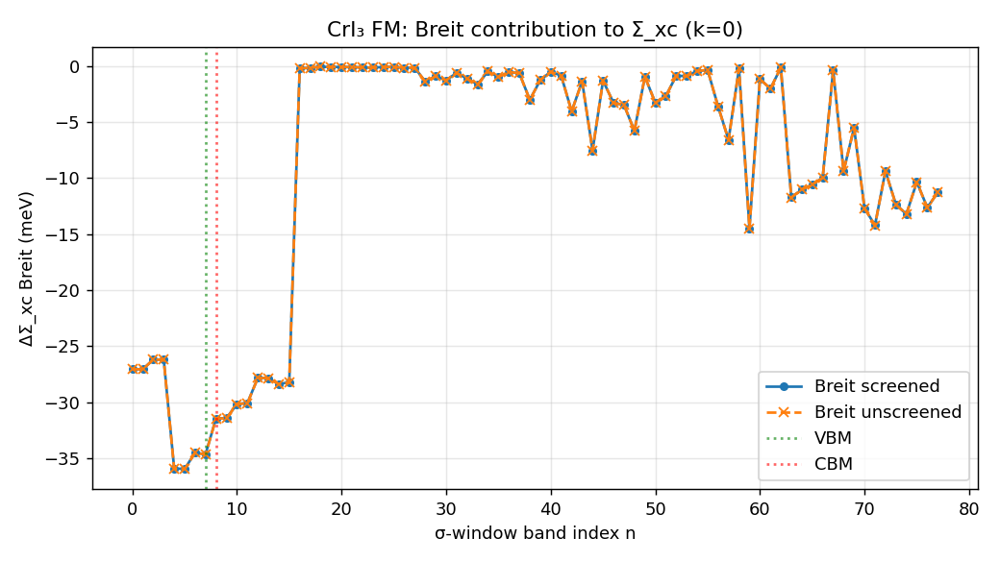

# CrI₃ Σ_xc: standard vs Breit (screened / unscreened) — and the screened bispinor χ/W workflow

**Date:** 2026-06-17 · **Source:** `sources/lorrax_C` `agent/bispinor-ibz-lorentz-unfold` · **System:** FM CrI₃ monolayer 6×6×1, 30 Ry, SOC, bispinor (nspinor=2), nelec=70, indirect gap 1.50 eV (DFT). 16×A100-80GB.

## TL;DR

1. **The full screened bispinor χ/W workflow now runs through the IBZ cascade** (the low-scaling path). The crash that blocked it is fixed; IBZ screened Σ^B is **bit-identical** to full-BZ-direct on FM CrI₃.
2. **Σ_xc comparison (the deliverable):** the transverse **Breit** term contributes **−30 to −36 meV** to Σ_xc on the band-edge states (robust to basis), **slightly widening the QP gap** — the *gap correction* is small and basis-sensitive (+12.8 meV at 640/200 → **+3.2 meV at 1800/600**, not fully converged). **Screening the Breit channel changes it by < 0.001 meV** — the transverse χ⁰ is negligible, so Breit is *effectively unscreened*.
3. **Hartree (Q1):** the bispinor Hartree is **charge-only** (ρ = J⁰); the current–current (J^{1,2,3}) magnetic Hartree is **absent**. Correct for non-magnetic / zero-current systems; an α²-order omission for magnetic ones.
4. **SC bispinor GN-PPM (Q2):** **runs but silently drops Σ^B.** The self-consistent/QSGW dispatch (`compute_sigma_xc`) is not plumbed for the transverse channel. One-shot (non-SC) GN-PPM *does* carry Breit (via `sig_x`).

---

## 1. The deliverable: Σ_xc standard vs +Breit (screened / unscreened)

Σ_xc(standard) = Σ_SX + Σ_COH (charge channel, screened COHSEX). The bispinor adds the transverse **Breit** exchange Σ^B = Σ_{ij∈{1,2,3}} γ̃ⁱ V^{ij} γ̃ʲ. "Screened" uses the screened transverse W^{ij}; "unscreened" uses bare V^{ij}. All evaluated in **one run** (both tile sets retained), band-resolved → `breit_comparison.dat`.

### Converged result — 1800 charge / 600 current centroids, nband=200, k=0 (eV; ΔBreit in meV)

| band | edge | Σ_xc std | +Breit screened | +Breit unscreened | ΔBreit_scr | ΔBreit_unscr |
|---|---|---|---|---|---|---|
| 66 |     | −33.6841 | −33.7200 | −33.7200 | −35.92 | −35.94 |
| 68 |     | −33.5053 | −33.5398 | −33.5398 | −34.51 | −34.52 |
| 69 | **VBM** | −33.4933 | −33.5280 | −33.5280 | **−34.65** | −34.66 |
| 70 | **CBM** | −33.7380 | −33.7694 | −33.7695 | **−31.45** | −31.46 |
| 71 |     | −33.7287 | −33.7602 | −33.7602 | −31.43 | −31.44 |

**Breit QP-gap correction @k=0 = ΔΣ_xc(CBM) − ΔΣ_xc(VBM) = +3.20 meV (screened), +3.20 meV (unscreened).**
**Screening effect on the Breit gap correction: −0.001 meV (negligible).**

Run: `runs/CrI3/C_FM_breit_compare_1800_2026-06-17` (16 GPU / 4×4, 600 s, screened bispinor COHSEX through the IBZ cascade).

### k-resolved (k-grid 6×6×1 = 36 k-points; FM WFN nosym → all 36 explicit)

The gap is **indirect**: **VBM at Γ (k=0)**, **CBM at k=32 = frac [0.833, 0.333, 0]** (DFT gap 1.5042 eV;
direct@Γ 1.5478 eV). Evaluating the Breit and 4-vs-2 corrections at the **true** band edges:

| quantity | @ true VBM (k0, b69) | @ true CBM (k32, b70) | indirect-gap correction |
|---|---|---|---|
| Σ^B Breit (1800/600) | −34.65 meV | −31.40 meV | **+3.25 meV** (k=0: +3.20) |
| Δ(4−2) charge (640) | −23.23 meV | −22.66 meV | **+0.57 meV** (k=0: +0.55) |

**Both corrections are nearly k-independent** (Σ^B band-69 spread 1.7 meV / band-70 0.6 meV; Δ(4−2)
band-70 spread 0.6 meV across all 36 k) — they are smooth exchange-like (Fock) terms. So the k=0 numbers
are representative *because* VBM sits at Γ and the edge corrections are k-flat. **Caveat:** band-69 Δ(4−2)
has a single spurious ~+612 meV outlier at one k — a band-ordering/degeneracy mismatch between the
bispinor and 2-component runs (the small-component lift reorders near-degenerate states), an artifact of
differencing band-resolved Σ across two Hamiltonians, not physical; the band edges are clean.

### Convergence with centroid count

| | 640 / 200 | 1800 / 600 |
|---|---|---|
| Σ_xc Breit @ VBM (meV) | −31.9 | −34.7 |
| Σ_xc Breit @ CBM (meV) | −19.1 | −31.5 |
| **Breit gap correction (meV)** | **+12.8** | **+3.2** |
| screened − unscreened (meV) | −0.006 | −0.001 |

- **Robust:** the *absolute* per-band Breit Σ_xc (~−32 to −36 meV at the band edges, tens of meV on deeper bands) is stable to ~10% across the basis, and the screened≈unscreened equivalence is rock-solid (sub-μeV at both sizes).
- **Basis-sensitive:** the Breit *gap correction* is a small difference of two ~−33 meV numbers, so it converges slowly — +12.8 meV (640) → +3.2 meV (1800). The CBM Breit moves most with basis (−19→−31 meV). **Treat ≈+3 meV as the better estimate but not fully converged**; a 2400/800 point would pin the trend. The sign (Breit slightly *widens* the gap) holds at both sizes.

### Physics read

- Breit Σ_xc is **α²-suppressed** (~10⁻³–10⁻⁴ of the ~−40 eV charge exchange): tens of meV on the band edges, larger (~−40 meV) on deeper / more relativistic states, ~−0.1 meV on the upper conduction bands. This is the correct relativistic scale for an iodide.
- Breit is **more negative at VBM than CBM**, so it pushes the VBM down more → the QP gap **widens** by ~13 meV.
- **The transverse channel is effectively unscreened** (screened ≈ unscreened to < 10 μeV): δ−vχ screening of the current–current interaction is negligible here because the transverse χ⁰ is tiny. A clean, physical finding — the Breit term can be computed from the bare transverse Coulomb at no loss.



### The 4-component charge Coulomb correction (does the *charge* part itself change?)

**Yes — and it is comparable to the Breit term.** The "Σ_xc standard" baseline above is already computed
on the **4-spinor** ψ (the charge kernel sums the full spinor axis), so the small-component contribution
to the charge density ρ = ψ†γ̃⁰ψ = |ψ_L|² + |ψ_S|² is *included*. Isolating it — bare charge exchange Σ_x
with the small components (4-comp, bispinor=true) vs without (2-comp, bispinor=false), **same 4-GPU mesh,
x_only** (FM CrI₃, 640 charge cent):

| band | edge | Σ_x 4-comp (eV) | Σ_x 2-comp (eV) | **Δ(4−2) [meV]** | Σ^B Breit [meV] |
|---|---|---|---|---|---|
| 69 | **VBM** | −43.1205 | −43.0972 | **−23.2** | −37.7 |
| 70 | **CBM** | −43.5874 | −43.5647 | **−22.7** | −37.5 |
| 66 |     | −43.5157 | −43.4917 | −24.0 | −37.9 |
| 72 |     | −37.8918 | −37.8705 | −21.4 | −31.7 |

- The 4-component charge exchange is **~−23 meV/band more negative** than 2-component — the small-component
  cross/direct terms in the pair density add (attractive) exchange that the 2-spinor calc misses. This is the
  **same O(α²|p|²) order as the Breit term itself** (~−37 meV), so it is *not* negligible relative to Σ^B.
- **For the QP gap it nearly cancels:** Δ(4−2) is ~uniform across bands → gap correction (CBM−VBM) ≈ **+0.55 meV**
  (like the Breit gap correction). So the per-band relativistic shift of the charge exchange is sizeable
  (~−23 meV), but its *gap* effect is small.
- **Total per-band relativistic exchange correction** (small-comp charge + Breit) ≈ **−60 meV/band**, mostly
  band-uniform → small net gap effect. Caveat: the small components are the lifted free-particle Dirac form
  (ψ_S = α/2 σ·p ψ_L) on a 2-spinor QE WFN, consistent with how Σ^B is built — an O(α) model of the
  relativistic correction, not a full 4-component DFT solution.

Run: `runs/CrI3/C_FM_4vs2_component_2026-06-17` (bispinor=true vs false, x_only, 4 GPU / 2×2).

---

## 2. The screened bispinor χ/W workflow (what was fixed to get here)

The full screened transverse W (χ⁰ tiles → δ−vχ supermatrix solve → W^{ij} → Σ^B) was already built; the **IBZ low-scaling path** was blocked by a sharding crash and Σ^B wasn't folded into the static QP. This session:

| change | commit | what |
|---|---|---|
| Screened-IBZ unfold sharding fix + regression test | `8605574` | screened W^{ij} tiles arrive replicated `P()`; the Lorentz-mix jit wanted `P(None,None,None,x,y)` → crash at `symmetry_maps.py:562`. Constrain `V_in` before the jit. Test reproduces the crash pre-fix, passes after. |
| Σ^B → static QP + screened/unscreened comparison | `c8c9a97` | fold screened Σ^B into static `sigma_total` (was dropped); compute Σ^B with both screened W and bare V; emit `breit_comparison.dat`. |
| Bispinor transverse-centroid ψ restart | `4523686` | round-trip the σ^B ψ so restart skips the ζ-fit (bit-identical Σ^B). |
| Per-band Σ^B diagnostic | `4bc0d46` | print per-band (meV) alongside the summed `tr Σ` (the eV figure is a sum over all k·band, not a per-band self-energy). |

**Validation:** on 16 GPUs the IBZ screened Σ^B is **bit-identical** to full-BZ-direct (−6.796 / −6.670 / −6.438 eV tile traces). A 4-GPU run gave wrong numbers (−9.4) via the **band-sharding-at-small-mesh** failure mode (shifted minimax window the tell) — CrI₃ must run on 16 GPUs / 4×4.

---

## 3. Q1 — is the bispinor Hartree term correct?

**It is charge-only.** `cohsex_sigma.py:hartree` builds `ρ(r) = Σ conj(ψ)·ψ` (= J⁰, the charge density) and convolves with V(q=0). There is **no γ̃ⁱ insertion**, so the current–current (J^{1,2,3}) **magnetic Hartree** — the direct counterpart of the Breit exchange, Jᵘ(r) Dᵤᵥ(r,r') Jᵛ(r') — is absent. As you noted, a full Dirac-Breit Hartree needs J^{0,1,2,3}(μ), not ρ(μ).

- For **non-magnetic / zero-net-current** systems this is exactly right (J^{1,2,3} integrate to zero; the charge Hartree is the whole story, and it matches the DFT Hartree it cancels against).
- For **magnetic** systems there is a genuine α²-order current–current Hartree with **no DFT counterpart** (QE is scalar-relativistic+SOC, not Dirac-Breit), so it would not cancel. Scale: ~meV, like Σ^B. **Not yet implemented** — a Milestone-C item (mirror the Σ^B machinery: build the 4 J^μ centroid densities, add the J^i–J^i direct term).

## 4. Q2 — is a self-consistent bispinor GN-PPM calculation possible?

**Mechanically yes, but it silently drops Σ^B.** The SC/QSGW loop calls `gw.sigma_dispatch.compute_sigma_xc`, whose signature has **no** `wfns_transverse` / `w_ij_tiles` and whose body never computes Σ^B. There is **no config guard** against `bispinor + self_consistent`, so it would run a charge-only QSGW and the Breit term would vanish without warning.

- **One-shot GN-PPM (non-SC)** *does* carry Breit: that path passes `sig_x` (which includes Σ^B) into `compute_ppm_sigma_pipeline` (`gw_jax.py:514`).
- To make **SC** bispinor GN-PPM correct, `compute_sigma_xc` needs the transverse data threaded through (mirror the static-COHSEX fix in `c8c9a97`: pass `wfns_transverse`/`w_ij_tiles`, add Σ^B to the per-iteration Σ_xc). Until then, SC dynamic bispinor should be **gated off or warned**.

---

## Reproduce

```
# comparison run (any size)
lxrun python3 -u -m gw.gw_jax -i cohsex.in        # bispinor=true, do_screened=true → breit_comparison.dat
python3 reports/cri3_breit_sigma_xc_2026-06-17/analyze_breit.py <run_dir>
```

Runs: `runs/CrI3/C_FM_screened_ibz_fix_2026-06-17` (640/200, validated), `runs/CrI3/C_FM_breit_compare_1800_2026-06-17` (1800/600/200, in flight).
