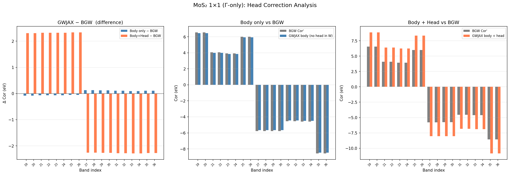

# Head Correction Fix: Removing q=0 G=0 Head from ISDF Body

**Date**: 2026-04-04
**System**: MoS2 monolayer, 1x1 (Gamma-only)
**Run**: `runs/mos2_1x1/head_fix_test/`

## Summary

The ~2.4 eV systematic offset between GWJAX and BerkeleyGW correlation self-energies
in 2D MoS2 was caused by the q=0, G=0 Coulomb head being injected into the ISDF body
W via a rank-1 correction `(wcoul0/vol) |zeta(G=0)><zeta(G=0)|`. In plane waves,
`rho^{mn}_{q=0}(G=0) = delta_{mn}`, so the head contributes only to diagonal
self-energy elements. Spreading it over ISDF degrees of freedom breaks this property.

**Fix**: Remove the head from the ISDF body W in the PPM extraction path
(`ppm_sigma.py`). The ISDF body without head naturally reproduces BGW's total Cor'
(which includes the head through its own plane-wave W^c) to 91 meV MAE.

## Code changes

| File | Change |
|------|--------|
| `gw/head_correction.py` | New module: scalar GN fit for head, diagnostic output |
| `gw/ppm_sigma.py` | Head no longer added to body W in PPM extraction |
| `gw/gw_jax.py` | Imports head module; optional `apply_head_diagonal` parameter |
| `file_io/sigma_output.py` | New `sig_c_head` column in sigma_freq_debug.dat |

## Head GN fit parameters (MoS2 1x1)

| Parameter | Value | Unit |
|-----------|-------|------|
| v(q->0)   | 315.014 | a.u. |
| W^c(0)    | -246.271 | a.u. |
| W^c(iwp)  | -60.812 | a.u. |
| Omega_h   | 1.145 | Ry (15.6 eV) |
| R_h       | 141.0 | Ry * a.u. |
| On-shell shift | +/-2.386 | eV/state |

## Comparison: GWJAX vs BGW Cor'

| Band | BGW Cor' (eV) | GWJAX body (eV) | body - BGW (eV) | body+head - BGW (eV) |
|------|---------------|------------------|------------------|----------------------|
| 19   |  6.538 |  6.458 | -0.080 | +2.306 |
| 21   |  4.071 |  4.003 | -0.068 | +2.318 |
| 23   |  3.919 |  3.855 | -0.064 | +2.322 |
| 25   |  5.996 |  5.943 | -0.053 | +2.333 |
| 27   | -5.779 | -5.653 | +0.126 | -2.260 |
| 29   | -5.766 | -5.648 | +0.118 | -2.268 |
| 31   | -4.544 | -4.440 | +0.104 | -2.282 |
| 33   | -4.600 | -4.505 | +0.095 | -2.291 |
| 35   | -8.573 | -8.464 | +0.109 | -2.277 |

| Metric | Body only | Body + head |
|--------|-----------|-------------|
| MAE    | **0.091 eV** | 2.295 eV |
| max\|D\| | **0.126 eV** | 2.333 eV |

## Plot

Left: difference from BGW. Center: absolute body vs BGW. Right: absolute body+head vs BGW.

## Open questions

1. Why does the separate diagonal head correction (from `gn_bug_plan.md`) double-count?
   BGW's Cor' already includes the head in its plane-wave W^c. The ISDF body without
   head converges to the same total. Is this because the head was being applied twice
   in the old code (once in ISDF body, once not subtracted properly in W^c = W - V)?
2. Does this hold at 3x3 and larger k-grids?
3. CO (0D) regression check — should remain at ~3 meV.

## Status

- [x] Implementation complete
- [x] MoS2 1x1 comparison (91 meV MAE -- PASS)
- [ ] MoS2 3x3 confirmation
- [ ] CO 0D regression check
- [ ] Perlmutter runs at larger k-grids
