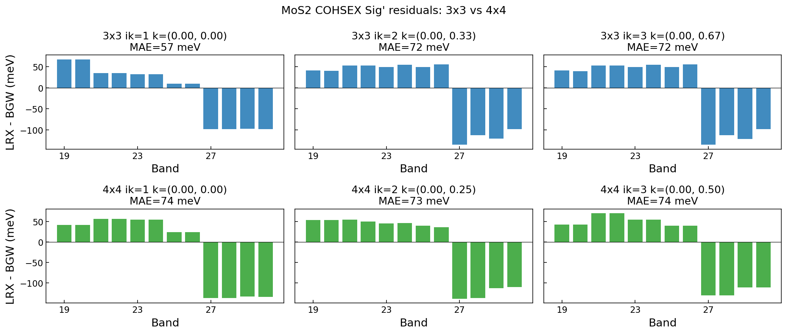
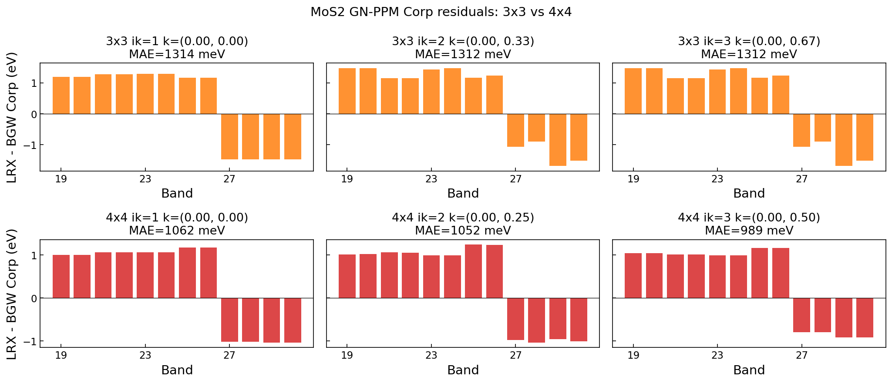

# MoS2 k-grid Convergence: 3×3 vs 4×4

**Date**: 2026-04-05
**Runs**: `runs/MoS2/00_mos2_3x3_cohsex/`, `runs/MoS2/01_mos2_4x4_cohsex_gnppm/`
**Code**: `fix_ppm_head_error` branch rebased onto new main (JIT-optimized PPM)

## Summary

Compared MoS2 COHSEX and GN-PPM between LORRAX and BGW on 3×3×1 and 4×4×1
k-grids. Both grids use 80 bands, 30 Ry ecutwfc, 640 centroids, 2D slab
truncation.

## Results

| Grid | Method | MAE (meV) | max (meV) | Band pairs |
|------|--------|-----------|-----------|------------|
| 3×3 | COHSEX Sig' | **67** | 135 | 48 |
| 4×4 | COHSEX Sig' | **73** | 139 | 60 |
| 3×3 | GN-PPM Corp | 1324 | 1691 | 48 |
| 4×4 | GN-PPM Corp | 1019 | 1245 | 60 |

### COHSEX

The ~70 meV COHSEX error is k-grid independent — 67 meV at 3×3, 73 meV at 4×4.
This confirms the error is intrinsic to the ISDF representation of the static
screened interaction, not a finite-size or sampling effect.

### GN-PPM

The GN-PPM Corp error improves from 1324 to 1019 meV going from 3×3 to 4×4 (25%
reduction). This is consistent with the known ISDF PPM body error being amplified
by the coarse-grid mini-BZ sampling — the PPM pole extraction from W(0) and
W(iωp) is sensitive to the quality of the ISDF representation of the frequency
dependence.

### New code verification

The rebased code (JIT-optimized PPM from new main) reproduces the old 3×3 GN-PPM
results to **<1 meV** (MAE = 0.0 meV, max = 1.0 meV across 282 band/k pairs).

## Timing (4× A100 GPUs, restart mode — excludes ISDF fitting)

| Grid | Method | Total | χ₀→W | PPM Σ^c | Pipeline | Restart I/O |
|------|--------|-------|------|---------|----------|-------------|
| 3×3 | COHSEX | **6.2 s** | 3.9 s | — | 0.8 s | 1.5 s |
| 3×3 | GN-PPM | **17.8 s** | 3.8 s | 11.1 s | 1.0 s | 1.9 s |
| 4×4 | COHSEX | **7.0 s** | 4.1 s | — | 0.9 s | 2.0 s |
| 4×4 | GN-PPM | **21.1 s** | 4.3 s | 14.0 s | 0.8 s | 2.0 s |

PPM sigma dominates at 62–66% of total time. The JIT-optimized code from new main
is substantially faster than the pre-optimization version (was ~420s for 1×1
Gamma-only; now 14s for 4×4 with 16 k-points).

From-scratch timing (including ISDF fitting):
- 4×4 COHSEX: 26 s total
- 4×4 GN-PPM: 38 s total

