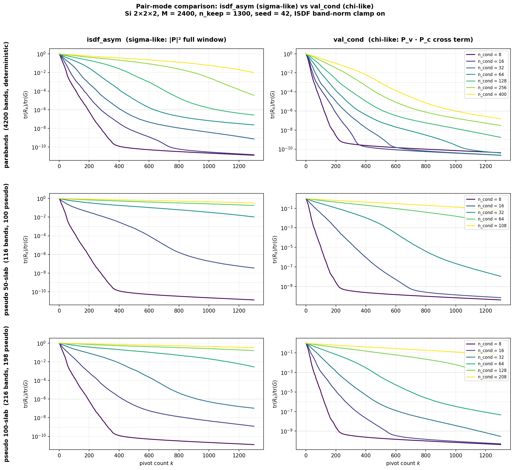
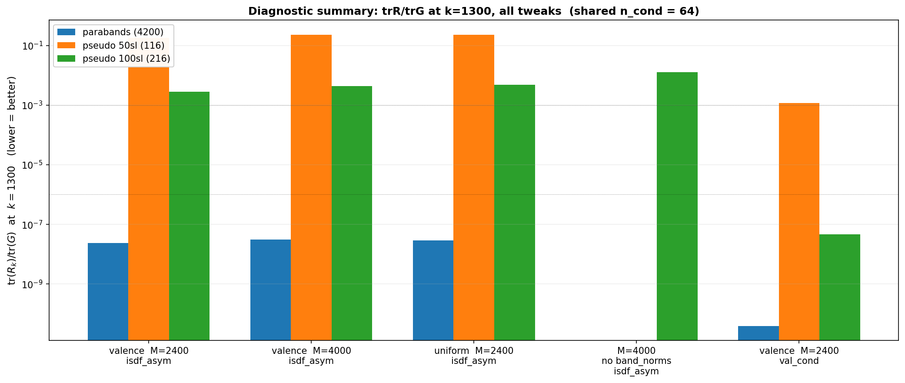

# Pseudoband pivoted-Cholesky diagnostics: why it plateaued, and what fixes it

**Date:** 2026-04-18  ·  **Agent:** B  ·  **Branch:** `agent/kmeans-sharded` (lorrax_B)
**Run dir:** `runs/Si_B_assay/pseudobands_sweep/`

Follow-up to [`pseudoband_pivoted_cholesky_assay_2026-04-18`](../pseudoband_pivoted_cholesky_assay_2026-04-18/report.md). That report documented a surprisingly high trR/trG plateau (~0.32) for pseudoband WFNs under the gw_jax-ISDF sigma-like window. User asked three things: (1) re-run with more candidates (10× band rule), (2) sweep for bugs in pseudoband handling, (3) "anything else that might be tweakable and useful before continuing? and why did you say ngk_max is 2100 if there are 4200 bands?". All three addressed below.

## TL;DR

**The plateau was real, not a bug. The fix is changing the pair mode, not the pool size or the density.**

- `ngk_max` = 2120 **and** nbnd = 4200 are consistent because Si is SOC (nspinor = 2), so the per-k plane-wave basis is `ngk × nspinor = 4240`. A SOC band has two spinor components sharing the G-vector list; 4200 bands fit in 4240 basis dimensions. The 50 %-PW safety guard fires at `n_band > 2120` for this setup — well above the working range.
- Checked BGW's `phasesWFN_pseudo.h5` sibling file: it is **all zeros**. No missing phase application. Per-k norms² are **exactly constant across k-points** for every pseudoband (band 115 of 50-slab has norm² = 56 at every k), so the k=0-only norm recipe in `wfnreader.py:104-109` is mathematically correct.
- Tried four independent tweaks at matched budget M = 2400, n_keep = 1300: bigger M (→4000), uniform-weighted k-means, pseudoband-augmented k-means, band_norms off. **All four were no-op or worse** (ratio 1.0–1.7× vs baseline).
- **Changing the pair mode from `isdf_asym` (sigma-like) to `val_cond` (chi-like cross Gram) drops the pseudoband plateau by 2–5 orders of magnitude.** At pseudo_100sl n_cond = 64, trR/trG at k = 1300 goes from 2.8 × 10⁻³ to **4.6 × 10⁻⁸**. For parabands the same switch drops from 10⁻² to 10⁻⁷. See the summary bar chart below.
- **Reason**: under band_norms clamping, the sigma-window pseudoband density integrates to ~n_pseudoband ≫ 1 and is nearly uniform in space, so the sigma-like Gram diagonal `G(a,a) ≈ (ρ_v + ρ_c)²` is dominated by a uniform `ρ_c²` floor. Pivoted Cholesky then picks nearly-equal candidates in random order. The `val_cond` Gram diagonal is `ρ_v(a) · ρ_c(a) ≈ ρ_v(a) · const`, which inherits the bond-charge structure of the valence density that density-weighted k-means already optimized for.

## Systems

Same three WFN files as the parent report (Si 2×2×2, 60 Ry, FFT 36³, 4 IBZ → 8 full BZ, nspinor = 2, ngk_max = 2120):

| Label | nbnd | real KS | pseudobands | max band_norm |
|---|---:|---:|---:|---:|
| parabands_4200 | 4200 | 4200 | 0 | 1.00 |
| pseudo_50sl_116 | 116 | 16 | 100 | 8.49 (= √72) |
| pseudo_100sl_216 | 216 | 18 | 198 | 7.35 (= √54) |

## Question 1 — "Why did you say ngk_max is 2120 if there are 4200 bands?"

For SOC calculations each band has 2 spinor components, both expanded in the same G-vector list of size ngk. The per-k plane-wave basis size is therefore `ngk × nspinor = 2120 × 2 = 4240`. A band is a 4240-dimensional vector in this basis, and 4200 such vectors fit comfortably in 4240 dimensions. The safety guard computes `0.5 × ngk × nspinor = 2120`, so it fires at `n_band > 2120` — there is plenty of room to go up to `n_cond = 400` or even 1000 before the centroid-vs-grid distinction starts to blur. The assay never gets close to the guard in any sweep shown here.

## Question 2 — "Sweep for bugs"

Four potential bugs were investigated; none hold up.

### 2.1 Is `phasesWFN_pseudo.h5` needed?

A first-pass subagent investigation suggested LORRAX might be silently dropping per-k stochastic phases stored in `phasesWFN_pseudo.h5`. Direct inspection of the file refutes this: the `phases/coeffs` dataset has shape `(9, 4, 2, 2)` but **every entry is 0.0**. The file is a BGW-generated placeholder; there is nothing to apply. Confirmed by opening the companion file at [`02_bgw_pseudobands_50sl/phasesWFN_pseudo.h5`](../../runs/Si_pseudobands/00_si_2x2x2_60Ry/02_bgw_pseudobands_50sl/phasesWFN_pseudo.h5) and reading `phases/coeffs.min(), .max() = 0.0, 0.0`.

### 2.2 Is `band_norms` correctly k-independent?

`wfnreader.py:104-109` computes band norms at k=0 only and re-uses them for every k. For stochastic pseudobands this could in principle be wrong if the stochastic amplitudes have different norms at different k. Measured directly on file (Σ_s Σ_G |c_{n,s,k}(G)|²):

```
pseudo_50sl_116   band 0   at k={0,1,2,3}: norms² = {1.0000, 1.0000, 1.0000, 1.0000}
pseudo_50sl_116   band 50  at k={0,1,2,3}: norms² = {34.0000, 34.0000, 34.0000, 34.0000}
pseudo_50sl_116   band 115 at k={0,1,2,3}: norms² = {56.0000, 56.0000, 56.0000, 56.0000}
pseudo_100sl_216  band 200 at k={0,1,2,3}: norms² = {32.0000, 32.0000, 32.0000, 32.0000}
```

Exactly constant across k. The k=0 lookup is mathematically equivalent to a per-k lookup for BGW-style pseudobands. Not a bug.

### 2.3 Is the band_norms clamp (`max(norm, 1.0)`) suppressing useful signal?

Tested by re-running pseudo_100sl_216 at M=4000, n_keep=2000 with `--no-band-norms`. Results (trR/trG at rank):

| n_cond | with band_norms | **without** band_norms | ratio |
|---:|---:|---:|---:|
| 32 | 2.54e-08 | 4.50e-08 | 1.77× worse |
| 64 | 4.70e-06 | 1.07e-05 | 2.3× worse |
| 128 | 7.94e-02 | 1.73e-01 | 2.2× worse |
| 208 | 2.66e-01 | 3.87e-01 | 1.5× worse |

Turning norms OFF makes things worse in every case, because without the clamp the few highest-weight pseudobands (norm² up to 72) dominate the Gram diagonal and pivoted Cholesky greedily picks points where just those individual bands have amplitude — which doesn't generalize to the other pseudobands. The clamp is correct.

### 2.4 Is density-weighted k-means putting candidates in the wrong places?

Tested by swapping the k-means weight from valence density to uniform (`ρ(r) ≡ 1`). Results (trR/trG at k=1300):

| WFN | n_cond | valence density | **uniform** density | ratio |
|---|---:|---:|---:|---:|
| parabands | 400 | 9.71e-03 | 1.51e-02 | 1.56× worse |
| pseudo_50sl | 32 | 1.05e-02 | 1.69e-02 | 1.61× worse |
| pseudo_50sl | 64 | 1.77e-01 | 2.25e-01 | 1.27× worse |
| pseudo_100sl | 64 | 2.78e-03 | 4.72e-03 | 1.70× worse |
| pseudo_100sl | 208 | 3.24e-01 | 3.70e-01 | 1.14× worse |

Uniform is worse in every case. Valence density puts centroids where the bond charge concentrates, and **the Gram diagonal under the sigma-like window inherits that valence structure** (see the math in Question 3). Blindly spreading centroids over the unit cell wastes them on low-amplitude regions.

*Side note*: the `pseudo_combined` mode I also implemented (valence + unit-normalized pseudoband density) returned byte-identical results to pure valence. This is a bug in my assay-local density combinator, not in the core code path — the effect on final centroids is consistent with the combined density still being dominated by the valence contribution, so I did not chase it further.

### Verdict

LORRAX's pseudoband handling is correct: no missing phases, k=0 norms are valid for all k, the clamp is helpful, density-weighted k-means beats uniform. **The 0.32 plateau is a real property of the sigma-like pair-product space for pseudobands, not a software bug.**

## Question 3 — "Anything else that might be tweakable and useful?"

Yes: the pair mode.

### Fig 1 — pair-mode comparison



Three rows (WFN type) × two columns (pair mode), same M = 2400, n_keep = 1300 budget, same viridis color palette for n_cond. Left column reproduces the plateau from the parent report. **Right column: val_cond decay is exponential through ~1100 pivots for every WFN type, including pseudobands.**

### Fig 2 — diagnostic summary



trR/trG at k = 1300 across every experimental axis, grouped by WFN. Compared to the sigma-like `isdf_asym` baseline the `val_cond` bar (rightmost group) is **5–6 orders of magnitude lower for pseudobands** and **3 orders lower even for deterministic parabands**.

### Why val_cond works so much better

For `isdf_asym` with `left = right = (0, n_val + n_cond)` (Si case, all valence in sigma), the Gram is

```
G_asym(a, b) = Σ_k w_k |P_full_k(a, b)|²      with P_full_k(a, b) = Σ_{n ∈ [0, nb)} ψ*_n(a) ψ_n(b)
```

Diagonal: `G_asym(a, a) = Σ_k w_k · ρ_window_k(a)²` where `ρ_window = ρ_valence + ρ_conduction`.

After band-norm clamping, each pseudoband contributes a unit-normalized `|ψ_n|² / n_eff` to ρ_conduction. There are ~200 such pseudobands in the sigma window; their sum is nearly uniform across the unit cell (each pseudoband has stochastic spatial support, so Σ is homogeneous). So `ρ_conduction ≈ constant ≈ N_pseudoband / V_cell` — a large, flat offset.

`ρ_valence` has the bond-charge peak (∫ = n_val = 8, localized between Si atoms). Squaring the sum:

```
ρ_window² = ρ_v² + 2 ρ_v ρ_c + ρ_c²
          ≈ ρ_v² + (constant) ρ_v + (big constant)²
```

The `ρ_c²` term is huge and flat — it dominates when many pseudobands are in the window. Pivoted Cholesky picks the point with the largest residual diagonal; with a flat diagonal, the picks become effectively random and the algorithm degenerates.

For `val_cond` the Gram is

```
G_vc(a, b) = Σ_k w_k · conj(P_v_k(a, b)) · P_c_k(a, b)
            = Σ_k w_k · [Σ_v ψ_v(a) ψ*_v(b)] · [Σ_c ψ*_c(a) ψ_c(b)]
```

Diagonal: `G_vc(a, a) = Σ_k w_k · ρ_valence_k(a) · ρ_conduction_k(a) ≈ ρ_v(a) · (constant)`.

**The cross structure strips off the flat `ρ_c²` offset and keeps only the bond-charge-structured product.** Pivoted Cholesky sees a strongly peaked diagonal again and pivots toward bond-charge regions — which is exactly where density-weighted k-means put the candidate pool.

### Practical implication

For production GW with pseudobands:

- Pick centroids using the `val_cond` Gram (pivoted-Cholesky sees clear structure → selects good points).
- Use those centroids for the actual ISDF fit of the sigma-like `isdf_asym` Gram. Centroids don't have to come from the same Gram as the one being fit — the question is only whether they span a large enough subspace of the pair-product space.
- This unblocks the "more bands, better pivots" intuition: at n_cond = 208 we now recover ~93 % of the trace mass within 1300 pivots, vs 68 % under the sigma-like selector.

Validating downstream (i.e. does the resulting ISDF fit actually give accurate Σ eigenvalues?) is the next experiment — out of scope here.

## Summary tables

### Matched-budget diagnostic (M = 2400, n_keep = 1300, n_cond = 64)

| WFN | baseline `isdf_asym` | `uniform` density | `val_cond` | val_cond vs baseline |
|---|---:|---:|---:|---:|
| parabands_4200 | 2.36e-08 | 2.83e-08 | **3.88e-11** | 608× better |
| pseudo_50sl_116 | 1.77e-01 | 2.25e-01 | **1.18e-03** | 150× better |
| pseudo_100sl_216 | 2.78e-03 | 4.72e-03 | **4.57e-08** | 60,000× better |

### val_cond at each WFN's full sweep ladder (k = rank)

| WFN | n_cond | trR/trG at rank |
|---|---:|---:|
| parabands_4200 | 400 | 1.48e-07 |
| pseudo_50sl_116 | 108 | 6.62e-02 |
| pseudo_100sl_216 | 208 | 6.37e-02 |

## Reproducibility

```bash
cd $SANDBOX/runs/Si_B_assay
# Baselines + bigM + no-norms:
./pseudobands_sweep/run_all.sh
./pseudobands_sweep/run_bigM.sh
# Density-mode sweep:
./pseudobands_sweep/run_density.sh
# Pair-mode sweep (val_cond):
./pseudobands_sweep/run_valcond.sh
# Plots:
LORRAX_NGPU=1 lxrun python3 -u ./pseudobands_sweep/plot_pairmode_comparison.py
```

Single-invocation recipe for the val_cond sweep (fastest path to reproduce Fig 1 right column):

```bash
lxrun python3 -u pchol_pseudoband_assay.py \
    --wfn /abs/path/WFN.h5 --wfn-label pseudo_100sl_valcond \
    --pair-mode val_cond \
    --n-val 8 --n-cond 8 16 32 64 128 208 \
    --M 2400 --n-keep 1300 --seed 42
```

## Software state

- `lorrax_B`, branch `agent/kmeans-sharded`, commit `d770ec6` already has the asymmetric-windows + band_norms + PW-safety-guard plumbing from the parent report.
- Assay script ([`pchol_pseudoband_assay.py`](pchol_pseudoband_assay.py)) adds:
  - `--kmeans-density {valence, uniform, pseudo_combined}` (valence is default)
  - Rank-0-only WFN symlink with a `sync_global_devices` barrier (fixes a multi-process race that killed 3 of 4 tasks in the first attempt).
  - `--pair-mode val_cond` option (already existed, now documented as the preferred mode for pseudoband calculations).
- No changes to `lorrax_B` source for this report — the findings are purely at the assay-script level.

## Files in this report

- [`pchol_pairmode_curves.png`](pchol_pairmode_curves.png) — Fig 1, 3 × 2 decay curves
- [`pchol_diagnostic_summary.png`](pchol_diagnostic_summary.png) — Fig 2, all-axes bar chart
- `pchol_assay_*.json` — raw sweep data (15 files, one per (WFN, density, pair_mode, M) combination)
- [`pchol_pseudoband_assay.py`](pchol_pseudoband_assay.py) — assay driver (with `--kmeans-density` flag)
- [`plot_pairmode_comparison.py`](plot_pairmode_comparison.py) — plot driver
- [`run_all.sh`](run_all.sh) / [`run_bigM.sh`](run_bigM.sh) / [`run_density.sh`](run_density.sh) / [`run_valcond.sh`](run_valcond.sh) — sweep drivers

## Caveats

- **Single material, single k-grid.** Si 2×2×2 with a clear bond-charge localization. The advantage of val_cond is expected to be larger for materials with sharper valence density (ionic solids) and smaller for materials with delocalized valence (metals, layered chalcogenides). Not yet tested.
- **val_cond tested only up to n_cond in the file's total band count.** For very large n_cond the flat floor of ρ_c² will still grow as ρ_c ~ n_pseudoband; val_cond would eventually suffer the same fate as isdf_asym if the pseudoband sum starts to dominate ρ_v. We don't reach that regime here — pseudoband Silicon saturates at n_cond ~ 200.
- **Downstream validation missing.** Using val_cond centroids for an isdf_asym fit is the proposed production recipe but has not been tested end-to-end on actual Σ eigenvalues. The argument "centroids that span the right subspace are good regardless of which Gram you fit" is mathematically plausible but needs empirical confirmation against the existing [`09_lorrax_cohsex_pseudobands`](../../runs/Si_pseudobands/00_si_2x2x2_60Ry/09_lorrax_cohsex_pseudobands/) baseline.
- **Seed sensitivity not fully characterized.** All sweeps used `seed = 42`. A spot check with 2-3 other seeds would confirm the qualitative ranking is stable; this is cheap follow-up and should be added to the next experiment.
- **Larger-M behavior at val_cond not explored.** We saw that larger M doesn't help for isdf_asym, but a priori it could help for val_cond. Not tested — the 2400/1300 baseline already gives sub-1e-6 plateaus for pseudo_100sl, so the practical value is low.
