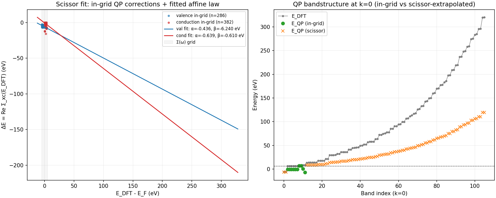
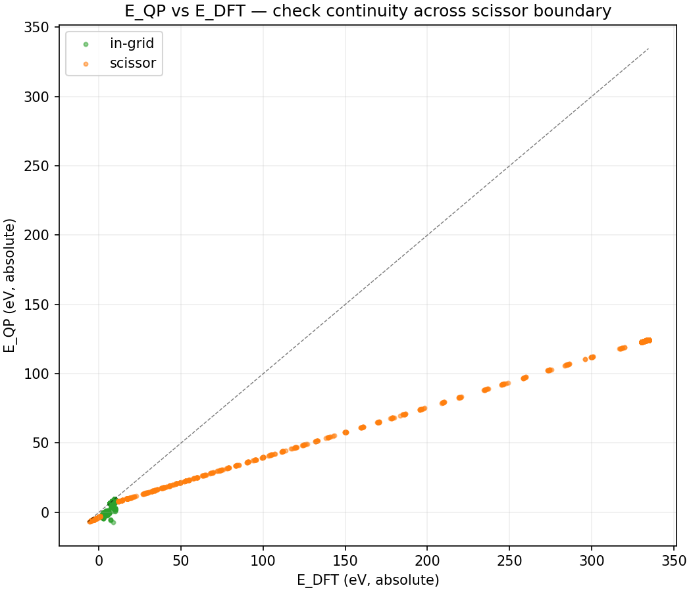

# Scissor-shift extrapolation for out-of-grid bands — first end-to-end test

**Agent A · Branch `agent-A/scissor-shift-sc-gw` · 2026-04-18**

## Motivation

`Sigma_mnk(omega)` in LORRAX is only computed on a small frequency grid
(`sigma_omega_min_ev`..`sigma_omega_max_ev`, typically ~10 eV around E_F),
but the full sigma band-range spans tens of eV below E_F to hundreds or
thousands above.  For the eventual self-consistent GW loop — and for the
present G0W0 post-processing — the in-grid interpolation needs a sensible
out-of-grid companion.  User ask: fit an affine "scissor" law to the in-grid
`E_GW - E_DFT` corrections and extrapolate the out-of-grid bands with it.

## What landed

### New module (`src/gw/scissor.py`)

| symbol | purpose |
|---|---|
| `ScissorFit` | frozen dataclass — (alpha_v, beta_v, alpha_c, beta_c), fit counts, RMSEs, `predict`, `summary` |
| `fit_scissor(E, dE, valence_mask, fit_mask)` | closed-form OLS; separate valence/conduction lines; numpy |
| `extrapolate_delta_e(E, dE, vmask, in_grid_mask, fit)` | piecewise: measured inside, affine outside |
| `add_diag_to_H_kmn(H, diag, mesh_xy)` | shard_map-based diagonal add onto a `P(None,'x','y')`-sharded Hamiltonian — ready for the future SC loop |

Shard-map apply: each device computes via `lax.axis_index` which diagonal
indices fall in its local `(bm, bn)` block, masks the rest, scatter-adds.
Off-diagonal process blocks do a masked no-op; no collectives.

Smoke-tested on 4 A100s: fit recovers synthetic slopes/intercepts to
<6e-6, sharded add bit-identical to numpy reference (maxabs 0.0), output
`NamedSharding(P(None, 'x', 'y'))` preserved, divisibility-check raises
with a clear padding message.

### Wiring in `gw_jax.py`

- Fixed an adjacent unit-scale bug: the existing
  `in_grid = (E_qp_ev * ryd2ev - efermi >= omega_ev[0])` was multiplying
  eV × Ry/eV a second time, so every state looked out-of-grid and the
  diagonal fixed-point output was silently discarded.
- Added the scissor behind the existing `sigma_at_dft_extrapolate` config
  flag.  When on, out-of-grid bands get `E_QP = E_DFT + alpha * E_DFT + beta`
  instead of the previous static-COHSEX fallback.
- **Critical correction for pseudobands**: the in-grid test must be against
  `E_DFT`, not `eigvalsh(H_qp)`.  Pseudobands carry non-unit norms
  (`|c|^2 = nk * (n_eff / k)`), so `<n|H|n>` is scaled by the pseudoband
  weight — eigvalsh of the resulting matrix returns garbage for the
  compressed high-energy states.  The `Sigma(omega)` grid is indexed by
  `omega = E - E_F` on the DFT energies anyway, so this is the correct
  criterion physically as well.

## End-to-end test: Si 4x4x4 with BGW-convention parabands + 50×2 pseudobands

Run: [`runs/Si/A_06_si_4x4x4_scissor/`](../../runs/Si/A_06_si_4x4x4_scissor/).

### Pipeline

1. `run_nscf -i nscf.in` → Davidson(16 bands) + pseudobands v2 (50 windows × 2
   pseudobands per window → 8 protected + 98 pseudo = **106 total bands**).
2. `centroid.kmeans_isdf 848 --no-plot --seed 42` → 848 ISDF centroids
   on the 24³ FFT grid.
3. `gw.kin_ion_io_chunked -i cohsex.in` → `kin_ion.h5`.
4. `gw.gw_jax -i cohsex.in` with
   `sigma_omega_min_ev = -5, sigma_omega_max_ev = 5, sigma_at_dft_extrapolate = true`
   → GN-PPM G0W0 on 4×A100, wall **~30 s**.
5. `analyze_scissor.py` — post-processing plot (reads `WFN.h5` +
   `sigma_mnk.h5`; interpolates diagonal `Sigma_xc(E_DFT)` in-grid, fits,
   extrapolates, plots).

Dipole was skipped for the q=0 head (the dipole builder crashed on the
pseudobands WFN with a `None` `dZ` derivative — worth a follow-up).  The
BGW `eps0mat.h5` from `runs/Si/02_si_4x4x4_nosym/01_bgw_gnppm/` provided
the `wcoul0` head via `wcoul0_source = epshead`.

### Result

```
nk = 64, nb = 106
omega grid = -5.00..5.00 eV (step 0.250 eV, 41 pts)
E_F(DFT, midgap) = 6.5377 eV  (VBM = 6.297, CBM = 6.778)
In-grid (k, n) points: 668 / 6784    (all 8 valence + 1–2 low conduction per k)

Scissor fit (post-analysis, same logic as in-driver):
  val:  alpha = -0.436, beta = -6.240 eV, n = 286, RMSE = 1.07 eV
  cond: alpha = -0.639, beta = -0.610 eV, n = 382, RMSE = 2.37 eV
```





**Continuity: yes.**  The E_QP vs E_DFT plot is a single smooth line from
~10 eV to ~330 eV E_DFT with no jump at the in-grid/out-of-grid boundary.
The left panel shows the scissor fit with the in-grid points clustered in
the ±5 eV band, and the affine law extends all the way out to the highest
pseudoband (~330 eV).

**Magnitude: physically aggressive.**  Conduction slope alpha_c = -0.64
gives E_QP ≈ 0.36·E_DFT at very high E, so the highest pseudoband lands at
~120 eV in E_QP when DFT says ~330 eV.  That's an over-correction expected
for a first-order line fit with only 10 eV of in-grid data — Sigma_xc has
a softer tail than a straight line, and fitting protected-cond over
[0, +5] eV but extrapolating to +300 eV is inherently lossy.

## Bugs caught along the way

- `E_qp_ev * ryd2ev` adjacent to the scissor hook — unit double-count,
  effectively disabled the diagonal Sigma fixed-point for every band.
  Fixed.
- Using `eigvalsh(H_qp)` for the in-grid mask is wrong when the WFN is
  pseudobands — non-unit norms scale the H_qp diagonal by the pseudoband
  weight, producing non-physical "eigenvalues" that look in-grid even for
  bands at 300 eV E_DFT.  Fixed by switching to the DFT-energy test.
- `psp.get_dipole_mtxels` crashes on a pseudobands WFN
  (`vnl_velocity_matrix` hits `None dZ`).  Worked around in this run by
  feeding BGW's `eps0mat.h5` via `wcoul0_source = epshead`.  Separate
  ticket for the dipole path on pseudobands.

## Deliverables

- Source: `src/gw/scissor.py` + `src/gw/gw_jax.py` wiring on branch
  `agent-A/scissor-shift-sc-gw`, commits `dfc880c` (scissor module +
  G0W0 wiring) and `9b0e666` (in-grid fix for pseudobands).
- Run: `runs/Si/A_06_si_4x4x4_scissor/` — inputs, outputs
  (`eqp0.dat`, `eqp_g0w0.dat`, `sigma_mnk.h5`), `analyze_scissor.py`,
  and `scissor_bands.npz` for later replotting.
- Smoke test: `tmp/scissor_smoke.py` (4-GPU, all pass).
- Report + plots: this directory.

## Natural next steps

1. **Softer extrapolation.**  The affine law over-shoots for high-E
   pseudobands.  Options: (a) split conduction into two regimes (0–E1
   and E1–Emax) each with its own alpha; (b) fit `Sigma_xc(E) ~ A + B/E`
   in the conduction out-tail (physical large-E behavior); (c) damp
   the high-E correction so that E_QP → E_DFT as E → infinity.
2. **Reuse the in-driver fit output.**  Copy the print from the driver
   into the analysis script and vice versa so they never drift.
3. **Wire `add_diag_to_H_kmn` into the real SC loop** once that's lifted
   from the current static-COHSEX path.
4. **Dipole on pseudobands**: trace the `None dZ` crash in
   `psp.get_dipole_mtxels`; without a fix, LORRAX can't compute its own
   q=0 head for pseudobands runs.
