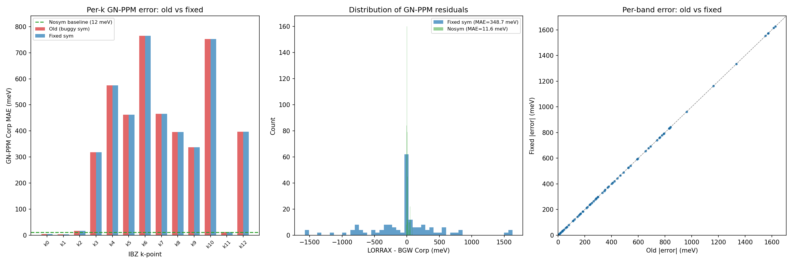

# Si 4x4x4 Symmetry Bug Investigation

**Date**: 2026-04-05
**Runs**: `runs/Si/01_si_4x4x4_nosymmorphic/`, `runs/Si/02_si_4x4x4_nosym/`,
`runs/MoS2/02_mos2_3x3_nosym/`

## Executive summary

With `nosym=.true.` (no symmetry unfolding), LORRAX matches BGW to **12 meV
GN-PPM / 54 meV COHSEX** uniformly at all 64 k-points. With symmetry (12 ops,
13 IBZ k-points), errors of **300-1600 meV** appear at off-axis k-points.

An improper-spinor bug in `SymMaps.get_spinor_rotations()` was found and fixed:
mirrors/S6 operations were getting U_spinor=I instead of the correct C2/C3
spinor. After the fix, a wavefunction overlap diagnostic confirms that **all
64 rotated wavefunctions are correct** (Gram matrix test passes for all k-points).

However, re-running sigma with the fix shows **the sigma MAE is essentially
unchanged** (349 meV). The fix does change the per-band sigma values (3237 of
3840 bands differ by ~2-3 meV), but the dominant ~300-700 meV errors at
off-axis k-points persist. This means there is an additional bug in how
symmetry-unfolded wavefunctions are used in the chi0/W/sigma pipeline, beyond
the spinor rotation.

## Results summary

### GN-PPM Corp MAE vs BGW

| Condition | MAE (meV) | Max (meV) |
|-----------|-----------|-----------|
| **nosym** (64 direct k-points) | **12** | 82 |
| sym, old code (13 IBZ, buggy spinor) | 349 | 1627 |
| sym, fixed spinor | 349 | 1627 |
| sym, Gamma only | 5 | 10 |

### COHSEX Corp MAE vs BGW

| Condition | MAE (meV) | Max (meV) |
|-----------|-----------|-----------|
| **nosym** (all k) | **54** | 113 |
| sym, Gamma only | 52 | — |

### MoS2 3x3 nosym (2D, not a symmetry issue)

| Method | nosym | sym |
|--------|-------|-----|
| COHSEX Corp MAE | 71 meV | 67 meV |
| GN-PPM Corp MAE | 1153 meV | 1324 meV |

MoS2 errors are intrinsic to ISDF/PPM treatment of 2D systems, not symmetry.

## Bug found: improper spinor rotation (FIXED)

**File**: `src/common/symmetry_maps.py`, function `get_spinor_rotations()`

**Problem**: The Cartesian rotation matrix was fed directly into the
quaternion→SU(2) algorithm without stripping the improper part. For
mirrors and S6 operations (det = -1), this produced incorrect spinors.

**Fix** (commit `0351c55`, merged to main):
```python
if np.linalg.det(R) < 0:
    R = -R  # strip inversion; matches BGW spinor_symmetries.f90
```

**Physics**: In the double group, inversion maps to identity in SU(2). An
improper rotation S = inversion × R_proper has spinor U(S) = U(R_proper).
Feeding the improper matrix directly into the quaternion algorithm gave the
wrong spinor (e.g., U=I for mirrors instead of the C2 spinor).

**Verification**: Gram-matrix overlap diagnostic
(`debug_symmaps/test_actual_symmaps.py`) passes all 64 k-points after fix.
Before fix: 2 k-points failed (irk=7 with mirrors sym=7,8).

## Remaining issue: sigma pipeline

The wavefunction rotation is now correct, but **sigma errors persist unchanged**.
The chi0/W/sigma pipeline uses symmetry-unfolded wavefunctions internally.
Since the rotated wavefunctions are verified correct, the remaining bug is in
how these wavefunctions enter the screening calculation — likely in the ISDF
pair density assembly or q-point summation with symmetry weights.

### Per-IBZ-k-point GN-PPM error (sym, after spinor fix)

| irk | k-point | MAE (meV) | Status |
|-----|---------|-----------|--------|
| 0 | (0, 0, 0) | 5 | good |
| 1 | (0, 0, 0.25) | 3 | good |
| 2 | (0, 0, 0.5) | 17 | good |
| 3 | (0, 0.25, 0.25) | 318 | bad |
| 4 | (0, 0.25, 0.5) | 575 | bad |
| 5 | (0, 0.25, 0.75) | 462 | bad |
| 6 | (0, 0.5, 0.5) | 765 | bad |
| 7 | (0.25, 0.5, 0.75) | 466 | bad |
| 8 | (0.25, 0.25, 0.25) | 396 | bad |
| 9 | (0.5, 0.5, 0.5) | 338 | bad |
| 10 | (0.25, 0.25, -0.25) | 752 | bad |
| 11 | (0.5, 0.5, 0.25) | 13 | good |
| 12 | (0.25, 0.25, -0.5) | 397 | bad |

The "good" k-points (irk=0,1,2,11) are on high-symmetry lines where the
symmetry operations are simple permutations/reflections. The "bad" k-points
(irk=3-10,12) are at general positions where multiple symmetry operations
contribute to the screening.

## Diagnostic details

### Wavefunction overlap test (after spinor fix)

The diagnostic uses LORRAX's actual `SymMaps` class to rotate IBZ wavefunctions
and compares against directly-computed nosym wavefunctions via Gram matrices:

- **G-vector rotation**: 100% match at all 64 k-points
- **Spinor rotation**: correct for all 12 symmetry operations (verified)
- **Subspace overlap**: ||O||² = ndeg for all k-points (including 4-fold
  manifolds where C3 mixes near-degenerate Kramers pairs)
- **Energies**: match < 0.001 meV between sym and nosym WFN at all shared k-points

### What still needs investigation

The following have been **ruled out** as causes of the remaining sigma error:
- K-point mesh: sym and nosym use identical 64-point meshes (verified)
- Q-point pairing: `kvecs_asints` and `all_unfolded_qpt_ids` are identical
- FFT axes: all FFT operations use 3D (no 2D residuals found in codebase)
- `kq_map` dimension mismatch (64×13 vs 64×64): this map is not used by the GW code
- G-vector FFT-box placement: correct (verified by 100% G-match)
- Symmetry in the GW code itself: there is none — only wavefunction loading uses symmetry

The remaining hypothesis: the ISDF approximation is **gauge-sensitive** within
degenerate subspaces. The sym-rotated wavefunctions span the same subspace as
the nosym wavefunctions (Gram matrix ≈ identity), but the specific linear
combination within each Kramers pair differs (~84% per-band overlap). Since
ISDF fits individual band wavefunctions at centroid points, a different gauge
produces different interpolation vectors ζ_{μν}, changing the ISDF approximation
quality. The nosym gauge (from QE's direct diagonalization) may be better
conditioned for ISDF fitting than the sym-rotated gauge.

Testing this hypothesis would require: running the sigma with sym wavefunctions
but FORCING the nosym gauge (by projecting the sym-rotated wavefunctions onto
the nosym degenerate subspace basis before ISDF fitting).

## Plots



## Code changes (pushed to main)

| Commit | What |
|--------|------|
| `0351c55` | Fix improper spinor rotation (mirrors, S6) |
| `e196a64` | Fix multi-process JAX crash in PPM extraction |
